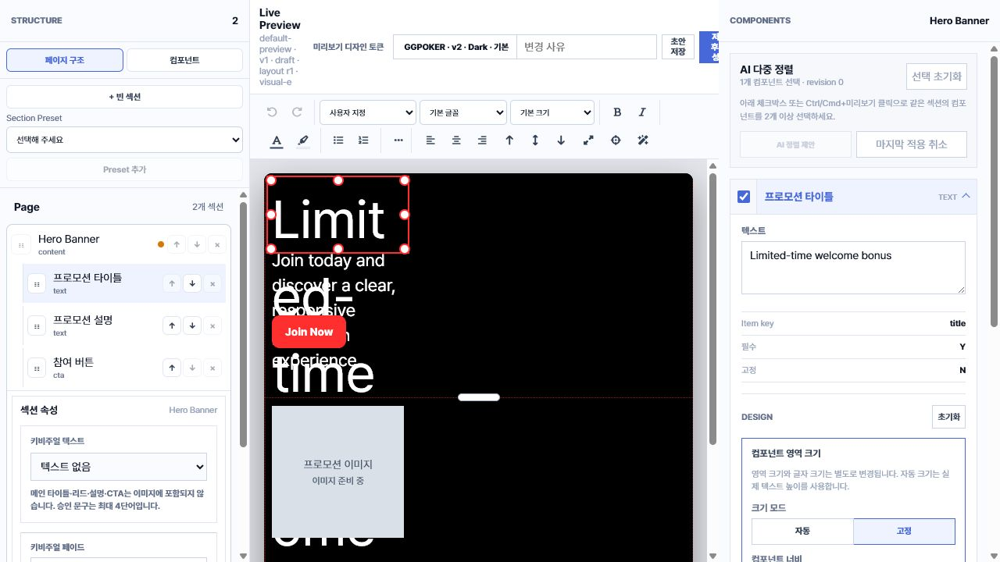
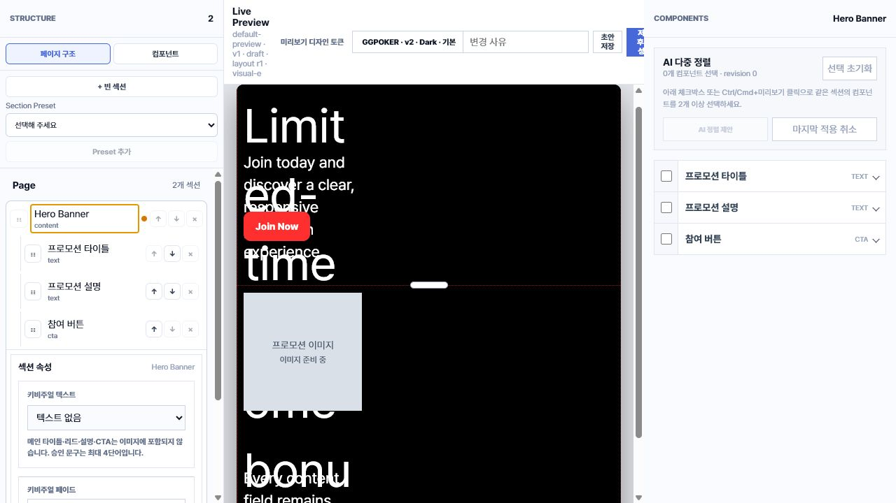
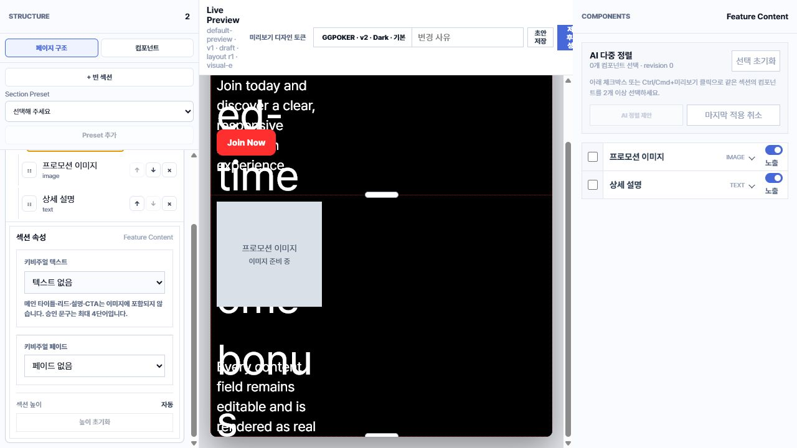
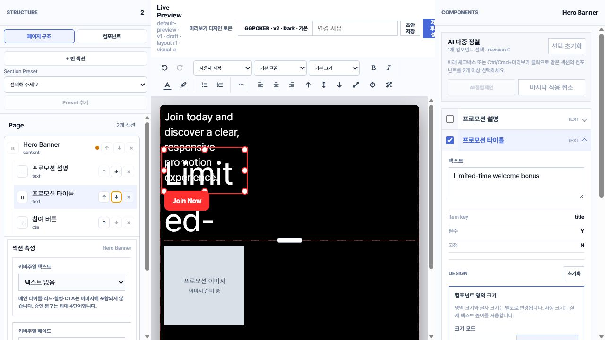

# 왼쪽 구조 패널 UX 검토

- 검토일: 2026-07-31
- 대상: Visual Editor 왼쪽 `STRUCTURE > 페이지 구조` 패널
- 범위: 섹션 접기/펼치기, 컴포넌트 순서 이동, AI 섹션 구성의 현재 의미
- 소스 코드는 수정하지 않음

## 1. 현재 선택 섹션이 열린 상태

- Hero Banner가 선택된 동시에 펼쳐진 상태이다.
- 선택 상태와 펼침 상태가 `selectedSection` 하나로 결합되어 있다.
- 섹션 이름을 다시 눌러도 펼침 상태를 별도로 변경할 수 없다.

## 2. 같은 섹션을 다시 선택한 상태

- 같은 Hero Banner를 다시 누르면 컴포넌트 선택만 해제된다.
- 하위 컴포넌트와 섹션 속성은 계속 열린다.
- 권장: `selectedSectionKey`와 `expandedSectionKey`를 분리한다. 섹션 행에 별도 펼침 버튼을 제공하고, 열린 섹션의 펼침 버튼을 다시 누르면 닫히게 한다.
- 기본 동작은 한 번에 하나만 여는 아코디언을 유지하되, 현재 섹션도 닫을 수 있게 하는 것이 적절하다.

## 3. 다른 섹션을 선택한 상태

- Feature Content를 선택해야 Hero Banner가 닫힌다.
- 이는 명시적인 접기 기능이 아니라 선택 변경의 부산물이다.

## 컴포넌트 상·하 이동

- 이 명령은 컴포넌트의 저장 배열과 DOM 출력 순서를 변경한다.
- 자동 배치 컴포넌트는 배열 순서를 기준으로 기본 위치를 계산하므로 위치가 바뀔 수 있다.
- 자유 배치·고정 좌표 컴포넌트는 좌표가 유지되어 일반적인 화면에서는 변화가 거의 보이지 않는다. 같은 z-index로 겹친 경우에만 페인팅 순서가 달라질 수 있다.
- 따라서 `위로/아래로`라는 표현은 화면 위치 이동처럼 보이지만 실제 효과는 배치 모드에 따라 달라 일관성이 없다.
- 권장: 기본 구조 패널에서는 컴포넌트 상·하 화살표를 제거한다.
- 화면 앞뒤 순서가 필요하면 별도의 `앞으로 가져오기/뒤로 보내기`와 z-index 기능으로 제공한다.
- 접근성 읽기 순서가 필요하면 일반 위치 버튼이 아니라 별도의 `읽기 순서` 관리 기능으로 구분한다.

## AI 섹션 구성의 현재 의미

- 현재 기능은 새 컴포넌트를 추가하거나 제거하는 구조 구성 기능이 아니다.
- 현재 섹션의 기존 컴포넌트를 대상으로 콘텐츠 변경, 배치 조정, 디자인 토큰 연결, 선택적인 키비주얼 생성을 제안한다.
- 관리자 레이아웃 모드에서는 노출되지 않고 프로모션 생성 모드와 AI 문서 모드에서만 활성화된다.
- 현재 이름은 기능 범위보다 넓어 오해를 만든다.
- 권장 이름: `AI 섹션 디자인 제안` 또는 `AI 콘텐츠·레이아웃 제안`.
- 실제로 컴포넌트 추가·삭제·순서 변경까지 하려면 별도의 `AI 컴포넌트 구성` 기능으로 구분하고 적용 전 변경 목록을 보여줘야 한다.

## 권장 AI 기능 분리

### AI 디자인 생성

- 기존 섹션과 기존 컴포넌트의 구조는 유지한다.
- 생성 전에 사용자가 디자인 요청사항을 자연어로 입력한다.
- 요청 범위는 레이아웃, 강조 대상, 분위기, 색상, 이미지 방향, 키비주얼로 제한한다.
- 기본값은 `콘텐츠 문구 유지`로 두고 디자인 토큰, 좌표, 크기, 배경 및 키비주얼만 제안한다.
- 생성 결과는 적용 전 비교 미리보기를 제공한다.

### AI 섹션 구성

- 빈 섹션을 추가한 직후 `직접 구성`과 `AI로 구성`을 선택하게 한다.
- 사용자는 섹션 목적과 필요한 내용을 입력한다.
- AI는 등록된 컴포넌트 라이브러리 안에서만 조합을 선택한다.
- 적용 전 추가할 컴포넌트, 순서, 필수 여부, 기본 레이아웃을 제안 목록으로 보여준다.
- 확정 후에만 섹션 컴포넌트 구조를 생성한다.

## 우선순위

1. P1: 선택과 펼침 상태를 분리해 현재 섹션을 직접 닫을 수 있게 한다.
2. P1: 상·하 화살표를 제거하고, 필요 시 레이어·읽기 순서를 별도 기능으로 분리한다.
3. P1: AI 디자인 생성에 요청사항 입력과 적용 전 미리보기를 추가한다.
4. P2: 빈 섹션의 `AI 섹션 구성`을 등록된 컴포넌트 조합 기능으로 분리한다.

## 확인 한계

- 화면 캡처 기반으로 시각 상태와 클릭 동작을 확인했다.
- 전체 키보드 트리 탐색과 스크린리더 안내는 별도 접근성 테스트가 필요하다.
