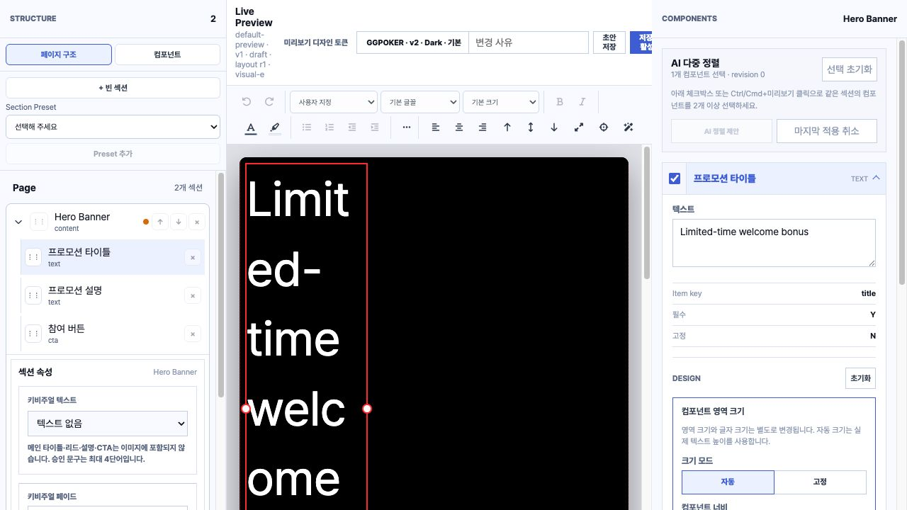
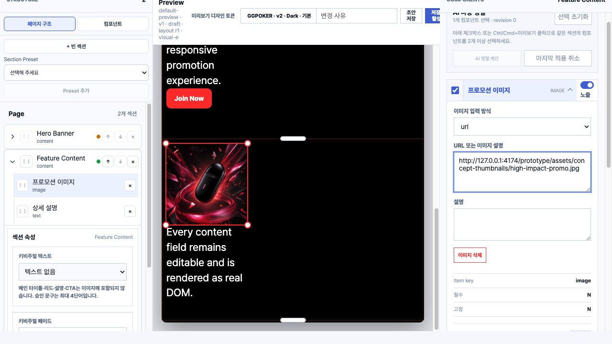
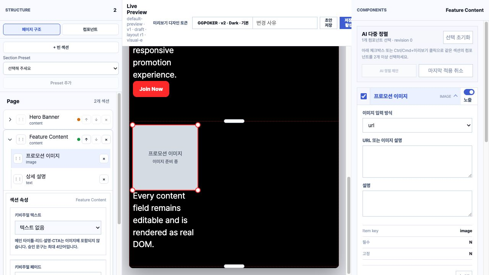
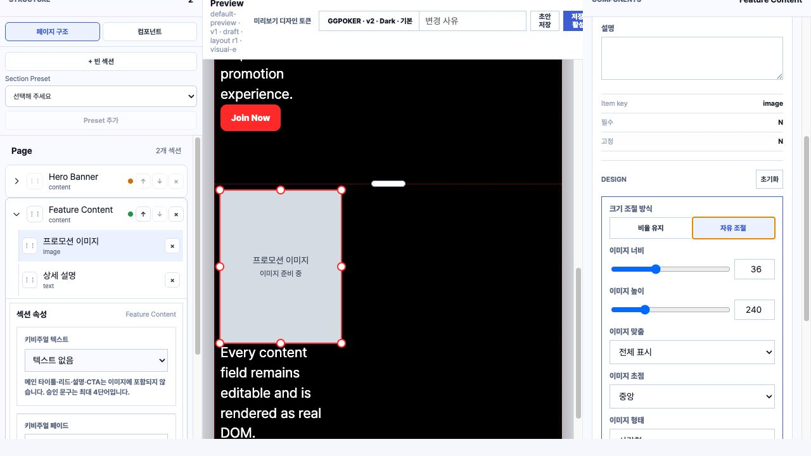
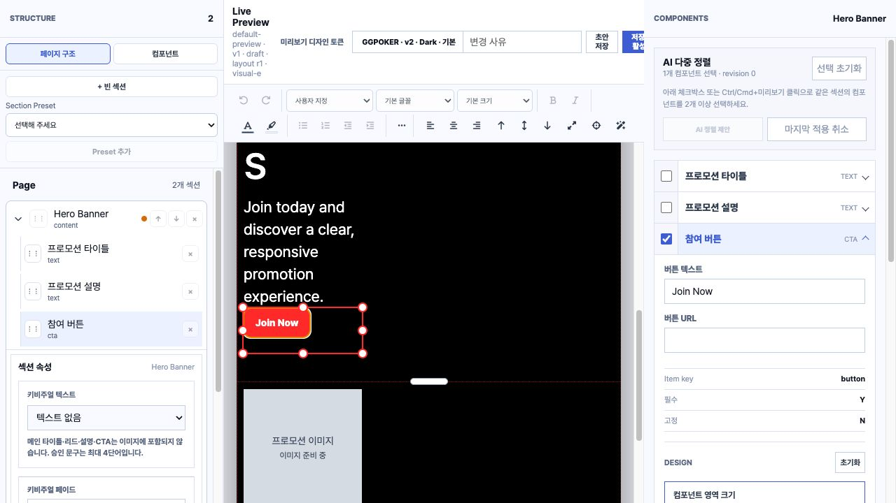
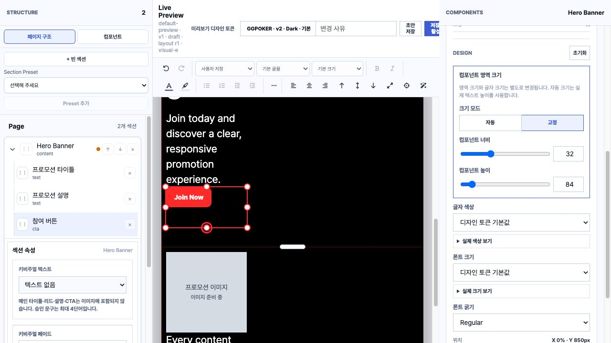
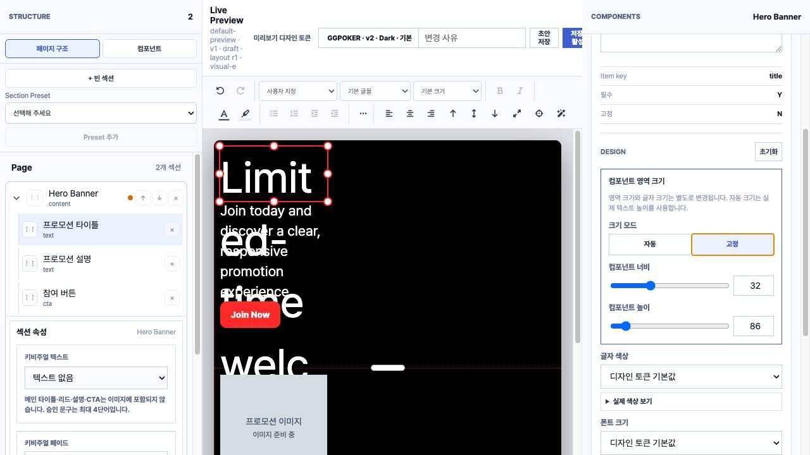

# Live Preview 컴포넌트 리사이즈 재감사

## 감사 범위

- 일시: 2026-08-01
- 기준: `main` / `17d4068`
- 대상: Live Preview의 텍스트, 이미지, CTA 선택·이동·포인터/키보드 리사이즈
- 환경: `scripts/serve-visual-editor-preview.js` fixture, Codex in-app Browser
- 성격: 진단과 의견 정리이며 제품 소스는 수정하지 않았다.

## 종합 의견

현재 리사이즈 기능은 이미지 전용 문제가 아니라 공통 Component frame과 실제 content 사이의 크기 계약이 일관되지 않은 상태다. 이미지 frame 자체의 `contain`/`cover`, 초점, 비율 유지 UI는 방향이 좋지만, pointer resize session 종료 보장, mode 전환 시 현재 높이 보존, fixed text overflow, CTA child sizing이 서로 다른 규칙으로 동작한다.

우선순위는 다음과 같다.

1. P0: resize session lifecycle을 drag와 같은 수준으로 통합한다.
2. P0: fixed text와 CTA에서 frame 크기와 실제 content 크기를 일치시킨다.
3. P1: 이미지 locked/free 전환 시 현재 렌더 높이를 보존한다.
4. P1: 최소 크기, 최대 높이, pointer target 정책을 Component 공통 규칙으로 통합한다.

## 확인 흐름

### Step 1. 텍스트 자동 높이 선택 — 주의

- 자동 높이에서는 item frame과 실제 텍스트 높이가 일치한다.
- 다만 Desktop Preview의 기본 `32%` 너비가 실제 중앙 canvas에서는 약 169px에 불과해 제목이 4~5글자 단위로 과도하게 줄바꿈된다.
- 기능 오류라기보다 초기 layout 품질 문제이며 title의 기본 width 또는 title preset을 별도로 두는 편이 낫다.

### Step 2. 이미지 선택과 실제 이미지 표시 — 양호

- 비율 유지 상태에서는 모서리 4개 handle만 제공되고, 자유 조절에서는 8개 handle이 제공된다.
- 실제 이미지 URL을 넣었을 때 `contain`, `cover`, focus position이 CSS background 규칙으로 정상 연결된다.
- 이미지 frame은 child가 `width: 100%; height: 100%`라 frame과 시각적 이미지 영역이 일치한다.

### Step 3. 이미지 pointer resize — 심각

- 실제 pointer drag 이후 `.is-resizing` class가 남는 상태를 재현했다.
- resize는 handle에서만 `pointermove`, `pointerup`, `pointercancel`을 수신한다.
- 일반 이동 기능에 있는 global pointer 종료, `lostpointercapture`, window blur, visibility change, 이전 session cleanup, pointer id/buttons 검증이 resize에는 없다.
- 브라우저 경계, capture 손실, 빠른 선택 변경에서 resize가 종료되지 않거나 다음 pointer 동작과 섞일 수 있다.

관련 코드:

- `visual-editor/src/PromoPageRenderer.vue:766-885`
- 비교 대상인 drag cleanup: `visual-editor/src/PromoPageRenderer.vue:749-763`

권고:

- `activeResizeCleanup`을 두고 한 번에 한 resize session만 허용한다.
- window 단위 `pointermove/up/cancel`, `lostpointercapture`, blur, visibility change, unmount cleanup을 공통 session helper로 묶는다.
- `pointerId`와 `buttons & 1`을 검사하고 cancel과 commit을 구분한다.

### Step 4. 이미지 자유 조절 전환 — 위험

- 비율 유지 상태에서 실측 크기는 약 `190 × 190px`이었다.
- `자유 조절`을 누르는 즉시 높이가 `240px`로 바뀌었다. 사용자는 모드만 바꿨지만 이미지 크기도 함께 바뀐다.
- 원인은 기존 `heightPx`가 없으면 현재 렌더 높이가 아니라 고정값 `240`을 기록하기 때문이다.

관련 코드:

- `visual-editor/src/App.vue:1619-1635`

권고:

- 모드 전환 전에 Preview item의 실제 높이를 읽어 `heightPx`로 보존한다.
- mode 변경과 geometry 변경을 하나의 Undo command로 묶되, 보이는 크기는 바뀌지 않아야 한다.

### Step 5. CTA 리사이즈 — 심각

- CTA item frame을 키보드로 `64px → 84px` 늘렸지만 실제 버튼은 계속 `42px`였다.
- 너비도 item은 약 `169px`인데 실제 CTA는 약 `95px`로 남는다.
- 사용자는 버튼 크기를 조절한다고 생각하지만 실제로는 버튼 주변의 투명한 selection/hit area만 조절한다.
- Property Panel은 저장값이 없을 때 `120px`를 표시하지만 renderer 기본 CTA 높이는 `64px`라 최초 표시값도 실제 frame과 다르다.

관련 코드:

- CTA 기본 높이: `visual-editor/src/platform/layout-engine/geometry.mjs:3-5`
- Property Panel fallback: `visual-editor/src/App.vue:2801-2823`
- CTA intrinsic CSS: `visual-editor/src/promo-renderer.css:54`

권고:

- CTA가 resizable component라면 `.rendered-cta`를 `width: 100%; height: 100%`로 frame에 맞춘다.
- CTA를 content-sized control로 유지하려면 세로 handle과 height control을 제거하고 padding/button-height 전용 control을 제공한다.
- 현재 UX에는 후자가 더 자연스럽다. CTA의 bounding box와 버튼 디자인 크기를 같은 개념으로 취급하지 않는 편이 안전하다.

### Step 6. 텍스트 고정 높이 전환 — 심각

- 자동 높이에서 title item과 텍스트는 모두 약 `690px`였다.
- `고정`을 누르면 item frame만 `86px`가 되고 텍스트는 계속 약 `690px`로 렌더링된다.
- overflow가 잘리지 않아 설명, CTA, 다음 Section 위로 텍스트가 겹친다.
- ResizeObserver가 측정하는 item frame은 `86px`이므로 section 자동 높이 계산도 실제 overflow를 수용하지 못한다.

관련 코드:

- fixed mode fallback: `visual-editor/src/App.vue:1530-1537`
- item height 지정: `visual-editor/src/PromoPageRenderer.vue:523-580`
- text CSS에는 fixed overflow 정책이 없음: `visual-editor/src/promo-renderer.css:37-54`

권고:

- fixed mode의 제품 의미를 먼저 정한다: clip, scroll, ellipsis, 또는 minimum-height 중 하나여야 한다.
- 프로모션 페이지 편집기에는 `minimum-height + content expansion`이 가장 안전하다.
- 정말 fixed frame이 필요하면 `overflow: hidden`과 명시적 경고, 잘림 표시를 함께 제공해야 한다.

## 공통 구조 위험

### P1. 최소 크기가 handle보다 작음

- 공통 최소값은 너비 `0.01%`, 높이 `1px`다.
- pointer handle은 `14 × 14px`라 component를 최소값 근처로 줄이면 handle이 겹치거나 component를 다시 선택하기 어렵다.
- 최소 pointer target도 일반 접근성 권고보다 작다.

관련 코드:

- `visual-editor/src/platform/layout-engine/geometry.mjs:7-8`
- `visual-editor/src/promo-renderer.css:60-68`

권고: 실제 canvas 기준 최소 frame을 최소 `24px`, 일반 Component는 `32~44px`로 두고 작은 시각 요소는 별도 scale control로 다룬다.

### P1. 최대 높이 규칙이 경로마다 다름

- pointer resize는 `1124 - y`를 사용한다.
- keyboard와 Property Panel은 `900px`을 사용한다.
- Section 확장은 `1200px`에서 clamp된다.

같은 component가 입력 방식에 따라 다른 최대값을 갖는다. `canvas bounds`, `component max`, `section max`를 한 정책 모듈에서 계산해야 한다.

## 접근성 위험

- resize button에 방향별 aria-label과 keyboard Arrow 조작이 있는 점은 좋다.
- 하지만 `nw`, `se` 같은 영문 방향 토큰은 사용자에게 자연스러운 안내가 아니다. `왼쪽 위`, `오른쪽 아래`로 현지화하는 편이 낫다.
- 14px handle은 pointer/touch target으로 작다. 보이는 원은 유지하더라도 pseudo-element 또는 투명 hit area로 최소 24px 이상을 확보해야 한다.
- resize 결과가 screen reader에 전달되지 않는다. keyboard 조작 후 `너비 36%, 높이 240px` 같은 polite live announcement가 필요하다.

## 검증 한계

- fixture의 기본 이미지는 비어 있어 로컬 저장소의 실제 thumbnail을 임시 URL로 입력해 `contain` 렌더링을 확인했다.
- 실제 업로드, AI 이미지 생성, 운영 DB 저장 및 Web Output persistence는 확인하지 않았다.
- 스크린샷과 DOM/geometry 실측으로 UX와 구조 위험을 확인했으며 전체 WCAG 준수를 의미하지 않는다.

