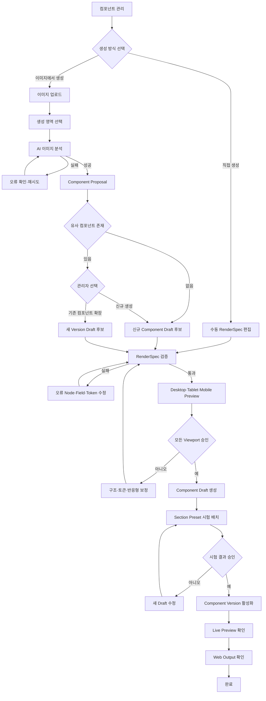
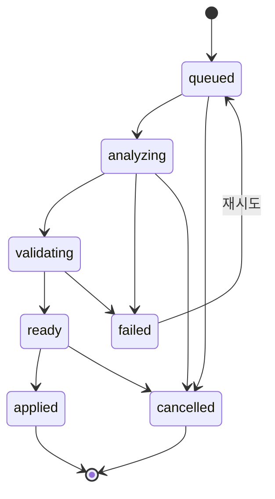

# DOM RenderSpec 기반 이미지 분석 컴포넌트 생성 개발 계획서

## 0. 문서 정보

- 작성일: 2026-09-09
- 대상 프로젝트: `promo_web_builder`
- 문서 상태: 개발 계획 초안
- 적용 영역: 컴포넌트 관리, Visual Editor Live Preview, Web Output, AI 이미지 분석
- 핵심 결정: 컴포넌트의 화면 구조를 임의 HTML이 아닌 검증 가능한 선언형 DOM `RenderSpec`으로 관리한다.
- 렌더링 원칙: Live Preview와 Web Output은 동일한 RenderSpec Renderer와 동일한 Runtime Theme을 사용한다.
- 생성 원칙: AI 분석 결과는 운영 컴포넌트로 즉시 반영하지 않고 검수 가능한 초안 Proposal로 만든다.
- 호환 원칙: 기존 필드형 컴포넌트와 기존 문서는 수정 없이 계속 렌더링한다.
- 제외 범위: Directus 연동, Directus 데이터 이전, 임의 JavaScript 실행, 무제한 HTML·CSS 저장

## 1. 배경과 문제 정의

현재 컴포넌트 시스템은 다음 기반을 이미 보유한다.

- 컴포넌트 및 컴포넌트 버전 관리
- 한 컴포넌트 안의 복수 `text`, `image`, `cta` 필드
- Library 표시 정보와 검색 키워드
- Section 역할별 배치 정책
- Desktop·Mobile 기본 Geometry
- Style Slot과 Design Token 연결
- 초안 생성, 저장, 활성화, 보관, 삭제
- Visual Editor와 Web Output의 Snapshot 기반 렌더링
- Contract v3의 독립적인 Runtime Theme

하지만 현재 `PromoPageRenderer`는 필드 종류와 개수에 따라 정해진 Vue Template 분기로 DOM을 만든다. 복수 필드 컴포넌트도 기본적으로 평면 목록으로 렌더링되므로 다음 형태를 표현하기 어렵다.

- 이미지 위에 문구와 CTA가 겹치는 프로모션 카드
- 아이콘, 제목, 본문이 중첩된 혜택 카드
- 가격, 배지, 혜택 목록, CTA를 포함한 복합 카드
- 배경 미디어와 전경 콘텐츠를 분리한 Hero 블록
- 의미 있는 Header, Navigation, Legal DOM 구조

웹 디자인 스크린샷이나 디자인 이미지를 분석해 컴포넌트를 생성하려면 AI가 콘텐츠 필드만 추출해서는 부족하다. 화면의 구조, 의미, 토큰, 반응형 규칙을 재현할 수 있는 제한된 렌더링 계약이 필요하다.

또한 2026-09-09 운영 화면 감사에서 `+ 컴포넌트 추가` 진입 시 `selectedItemComponent`가 비어 있는데도 상태를 읽어 빈 화면이 되는 오류가 확인됐다. 신규 생성 Editor의 `libraryPresentation`과 `placementPolicy` 기본값도 완전하게 초기화되지 않는다. 이 오류는 신규 기능 개발 전에 해결해야 한다.

## 2. 결정 요약

### 2.1 채택

- 선언형 JSON 기반 `Component RenderSpec v1`
- 허용된 DOM 요소와 속성만 사용하는 Allowlist
- 기존의 불변 `fieldKey`를 통한 콘텐츠 바인딩
- Raw CSS 값보다 의미 기반 Design Token 바인딩 우선
- 제한된 Layout Primitive와 반응형 Override
- Live Preview와 Web Output이 공유하는 단일 Renderer
- 이미지 분석 결과를 Proposal로 저장한 뒤 사람이 승인해 Draft 생성
- 기존 컴포넌트의 Legacy Renderer Fallback 유지

### 2.2 채택하지 않음

- 브라우저에서 복사한 HTML 원문 저장
- AI가 생성한 Vue·React·JavaScript 코드의 즉시 실행
- `<script>`, `<iframe>`, 인라인 Event Handler 허용
- 컴포넌트마다 독립 CSS 파일 생성
- 검수 없이 AI 결과를 활성 버전으로 게시
- Screenshot의 Desktop 화면만 보고 Mobile 구조를 확정

## 3. 목표

### 3.1 제품 목표

- 관리자가 디자인 스크린샷 또는 이미지를 업로드할 수 있다.
- 전체 이미지 또는 선택 영역을 하나의 컴포넌트 후보로 분석할 수 있다.
- AI가 DOM 구조, 콘텐츠 필드, 토큰 바인딩, 반응형 규칙을 제안한다.
- 관리자는 Desktop·Tablet·Mobile Live Preview에서 결과를 확인하고 수정할 수 있다.
- 승인된 결과만 컴포넌트 Draft v1 또는 기존 컴포넌트의 새 Draft Version으로 저장한다.
- 활성화된 컴포넌트가 Visual Editor와 Web Output에서 동일하게 보인다.
- 디자인 토큰 세트를 변경하면 컴포넌트 구조는 유지하면서 색상·서체·간격·반경이 테마에 맞게 바뀐다.

### 3.2 기술 목표

- `wizard_item_component_versions`에 버전 소유의 RenderSpec 계약을 추가한다.
- RenderSpec Parser, Validator, Sanitizer, Compiler를 공용 모듈로 제공한다.
- 기존 Renderer와 신규 RenderSpec Renderer를 안전하게 공존시킨다.
- Snapshot에 RenderSpec과 계약 버전을 포함해 과거 Revision을 결정론적으로 재현한다.
- Export Manifest에 RenderSpec Version과 Hash를 기록한다.
- 이미지 분석은 Structured Output만 허용하고 서버 Validator를 반드시 통과시킨다.
- Source Image, 분석 Run, Proposal, 적용 결과를 추적 가능하게 저장한다.

## 4. 비목표

- 범용 웹사이트 제작기 수준의 모든 HTML·CSS 지원
- 외부 JavaScript Library 삽입
- 사용자 작성 JavaScript Expression 실행
- 픽셀 단위 Screenshot 완전 복제 보장
- 첫 단계에서 전체 페이지를 여러 Section과 Component로 자동 분해
- 첫 단계에서 임의 반복문과 복잡한 데이터 조건문 지원
- 기존 활성 컴포넌트의 일괄 RenderSpec 변환
- 기존 Snapshot의 일괄 재작성
- Directus Collection 설계 및 마이그레이션

## 5. 목표 사용자 흐름

```text
컴포넌트 관리
→ 이미지에서 생성
→ Screenshot 업로드
→ 생성할 영역 선택
→ AI 분석 시작
→ DOM·필드·토큰 Proposal 생성
→ 기존 컴포넌트 유사도 확인
→ Desktop·Tablet·Mobile Live Preview
→ 구조·콘텐츠·토큰 수정
→ 검증 통과
→ 컴포넌트 초안 생성
→ Section Preset에서 시험 배치
→ 활성화
→ Web Output 확인
```

### 5.1 MVP 입력 범위

- 파일 형식: PNG, JPEG, WebP
- 최대 파일 크기: 초기 10MB
- 최대 해상도: 긴 변 8,192px, 분석용 Downscale 별도 생성
- 생성 단위: 한 번에 선택 영역 하나, 컴포넌트 한 개
- 선택 방식: 전체 이미지 또는 사각형 Crop
- 추가 입력: 컴포넌트 이름, 용도, 사용할 Section 역할, 보존할 요소에 대한 자연어 지침

### 5.2 MVP 결과 범위

- 단일 Root를 가진 RenderSpec
- 중첩 Container
- 텍스트, 이미지, CTA Field Binding
- 정적 장식 요소가 아닌 Token 기반 Surface
- Flex 또는 제한된 Grid Layout
- Desktop·Tablet·Mobile Override
- 접근성 기본 정보
- 분석 신뢰도와 확인 필요 항목

## 6. Component RenderSpec v1

### 6.1 기본 구조

```json
{
  "contractVersion": 1,
  "root": {
    "nodeType": "element",
    "tag": "article",
    "semanticRole": "surface",
    "layout": {
      "display": "grid",
      "columns": 1,
      "gapToken": "spacing.component.md",
      "paddingToken": "spacing.component.lg"
    },
    "tokenBindings": {
      "backgroundColor": "color.surface.primary",
      "borderRadius": "radius.card",
      "boxShadow": "shadow.card"
    },
    "children": [
      {
        "nodeType": "field",
        "tag": "img",
        "fieldKey": "fld_product_image",
        "tokenBindings": {
          "borderRadius": "radius.media"
        }
      },
      {
        "nodeType": "element",
        "tag": "div",
        "semanticRole": "content",
        "children": [
          {
            "nodeType": "field",
            "tag": "h2",
            "fieldKey": "fld_title",
            "tokenBindings": {
              "color": "color.text.primary",
              "fontFamily": "typography.heading.family",
              "fontSize": "typography.heading.lg"
            }
          },
          {
            "nodeType": "field",
            "tag": "a",
            "fieldKey": "fld_primary_cta",
            "tokenBindings": {
              "backgroundColor": "color.action.primary",
              "color": "color.action.onPrimary",
              "borderRadius": "radius.button"
            }
          }
        ]
      }
    ]
  },
  "responsive": {
    "tablet": {},
    "mobile": {
      "root.layout.columns": 1,
      "root.layout.paddingToken": "spacing.component.md"
    }
  }
}
```

### 6.2 Node Type

| Node Type | 용도 | MVP |
|---|---|---:|
| `element` | 구조와 Surface를 만드는 Container | 포함 |
| `field` | 기존 `fieldKey` 콘텐츠를 DOM에 출력 | 포함 |
| `slot` | 자식 콘텐츠 또는 관리자가 선택한 컴포넌트 삽입 | 후속 |
| `repeat` | Collection 기반 반복 렌더링 | 후속 |
| `condition` | 콘텐츠 존재 여부에 따른 분기 | 제한적으로 후속 |

### 6.3 허용 Tag

MVP Allowlist:

```text
div, section, article, header, footer, nav, main,
h1, h2, h3, h4, h5, h6, p, span, strong, small,
img, picture, a, button, ul, ol, li
```

다음 Tag는 금지한다.

```text
script, style, iframe, object, embed, form, input, textarea,
video, audio, canvas, svg
```

아이콘과 Vector Asset은 Inline SVG를 AI가 생성하지 않고 승인된 Icon Registry 또는 Resource Registry를 통해 참조한다.

### 6.4 속성 정책

허용 속성:

- `role`
- `aria-label`, `aria-labelledby`, `aria-describedby`, `aria-hidden`
- `alt`
- `href`, `target`, `rel`
- `src`, `srcset`, `sizes`는 Resource 또는 Field Binding을 통해서만 설정
- 제한된 `data-*`는 Renderer 내부 식별 용도만 허용

금지 속성:

- `on*` Event Handler
- Raw `style` 문자열
- 임의 `class` 문자열
- `javascript:` URL
- 외부 Script·Stylesheet 참조

### 6.5 콘텐츠 바인딩

- 모든 동적 콘텐츠는 서버가 발급한 불변 `fieldKey`를 참조한다.
- `text` Field는 텍스트 계열 Tag에만 바인딩한다.
- `image` Field는 `img` 또는 승인된 Media Wrapper에만 바인딩한다.
- `cta` Field는 `a` 또는 `button`에만 바인딩한다.
- RenderSpec이 참조하지만 Component Version에 없는 Field는 저장을 차단한다.
- Component Version의 필수 Field가 RenderSpec에 없으면 저장을 차단한다.
- 데이터가 없는 선택 Field는 Node 단위로 숨김 처리하되 DOM 구조가 깨지지 않아야 한다.

### 6.6 Layout Primitive

Raw CSS 대신 다음 제한된 속성을 지원한다.

- `display`: `block`, `flex`, `grid`
- `direction`: `row`, `column`
- `wrap`: `nowrap`, `wrap`
- `alignItems`, `justifyContent`: 허용 Enum
- `columns`: 1~12 정수
- `gapToken`, `rowGapToken`, `columnGapToken`
- `paddingToken`, 방향별 Padding Token
- `width`: `%` 범위 또는 `auto`
- `minHeight`, `maxWidth`: 검증된 제한값 또는 Token
- `aspectRatio`: 승인된 비율
- `positionMode`: MVP에서는 `flow`, 후속에서 제한된 `overlay`
- `overflow`: `visible`, `hidden`, `clip`

### 6.7 Design Token 바인딩

RenderSpec에는 다음과 같은 Raw 값을 저장하지 않는 것을 원칙으로 한다.

- HEX, RGB, HSL 색상
- 임의 Font Family
- 임의 Shadow 문자열
- 임의 CSS Gradient

Property별 허용 Token Type을 검증한다.

| Property | 허용 Token Type |
|---|---|
| `color`, `backgroundColor`, `borderColor` | Color |
| `fontFamily` | Font Family |
| `fontSize`, `lineHeight`, `letterSpacing`, `fontWeight` | Typography |
| `padding`, `gap`, `margin` | Spacing |
| `borderRadius` | Radius |
| `boxShadow` | Shadow |
| `maxWidth`, `minHeight` | Size |

토큰 해석 우선순위:

```text
Document Runtime Theme
→ 활성 Design Token Set Version
→ Component가 선언한 안전한 Fallback Token
→ Renderer System Default
```

값 자체가 아니라 Token Key를 Snapshot에 저장하고, 재현성을 위해 사용한 Design Token Set Version ID와 Token Values Snapshot을 함께 고정한다.

### 6.8 반응형 정책

- 임의 Media Query 문자열을 저장하지 않는다.
- `mobile`, `tablet`, `desktop` 의미 Breakpoint만 사용한다.
- Breakpoint의 실제 px 값은 Runtime Theme 또는 Renderer 정책이 결정한다.
- 각 Breakpoint는 전체 Tree를 복제하지 않고 변경되는 Layout·Token Binding만 Override한다.
- AI가 Desktop 이미지 한 장만 분석한 경우 Mobile 구조는 `inferred`로 표시하고 관리자 확인을 요구한다.

## 7. 공통 Renderer 구조

```text
Component Version
  ├─ Field Definitions
  ├─ RenderSpec
  └─ Placement Policy
           ↓
RenderSpec Validator + Compiler
           ↓
Shared Component Renderer
  ├─ Admin Draft Preview
  ├─ Visual Editor Live Preview
  ├─ Web Output Runtime
  └─ Export Screenshot Test
```

### 7.1 단일 Renderer 원칙

- Live Preview용 DOM과 Web Output용 DOM을 별도로 구현하지 않는다.
- Editor 전용 선택 Handle, Guide, Inspector Trigger는 Renderer 외부 Decoration Layer로 분리한다.
- Output에서는 Decoration Layer만 제거하고 동일 Component DOM을 사용한다.
- 동일 Snapshot, 동일 Runtime Theme, 동일 Viewport에서 DOM 구조와 Computed Token 값이 같아야 한다.

### 7.2 Legacy Fallback

```text
renderSpec 존재 + 검증 성공 → RenderSpec Renderer
renderSpec 없음             → 기존 Field Renderer
renderSpec 검증 실패         → 저장·활성화 차단
과거 Snapshot               → 기존 Renderer로 그대로 재현
```

Runtime 중 검증 실패를 조용히 Legacy Renderer로 대체하지 않는다. 활성화 전에 차단하고, 과거 데이터의 예상치 못한 손상에만 명시적 오류 UI와 안전한 Fallback을 제공한다.

## 8. 데이터 모델

### 8.1 컴포넌트 버전 확장

`wizard_item_component_versions`에 다음 컬럼을 추가한다.

| 컬럼 | 타입 | 용도 |
|---|---|---|
| `render_contract_version` | integer nullable | `NULL`은 Legacy Renderer |
| `render_tree` | jsonb | 선언형 DOM Tree |
| `render_responsive` | jsonb | Breakpoint Override |
| `render_accessibility` | jsonb | 접근성 정책과 검증 결과 |
| `render_validation` | jsonb | 마지막 검증 결과·Hash |

권장 제약:

- `render_contract_version`은 `NULL` 또는 지원 Version
- `render_tree`, `render_responsive`, `render_accessibility`, `render_validation`은 JSON Object
- 활성 Version은 `render_validation.ok = true`
- RenderSpec Hash를 생성해 Snapshot과 Manifest에서 비교

### 8.2 이미지 Source와 Proposal

신규 테이블 후보:

#### `component_design_sources`

- `id`
- `storage_key`
- `mime_type`
- `byte_size`
- `width`, `height`
- `content_hash`
- `crop_spec`
- `status`
- `created_at`, `expires_at`, `deleted_at`

#### `component_generation_runs`

- `id`
- `source_id`
- `status`: `queued`, `analyzing`, `validating`, `ready`, `failed`, `applied`, `cancelled`
- `prompt_version_id`
- `model_snapshot`
- `input_hash`
- `attempt_count`
- `error_code`, `error_message`
- `created_at`, `updated_at`, `completed_at`

#### `component_generation_proposals`

- `id`
- `run_id`
- `proposal_version`
- `component_definition`
- `render_spec`
- `responsive_spec`
- `token_bindings`
- `confidence`
- `review_notes`
- `validation_result`
- `applied_component_id`, `applied_version_id`
- `created_at`, `applied_at`

Directus 이전을 고려해 Source, Run, Proposal, Component Version의 경계를 분리하지만 이번 개발에서는 기존 PostgreSQL API가 소유한다.

### 8.3 Snapshot 확장

Section Snapshot의 Component Item에 다음 정보를 포함한다.

```json
{
  "componentVersionId": "...",
  "renderContractVersion": 1,
  "renderSpec": {},
  "renderSpecHash": "sha256:...",
  "fields": [],
  "placementPolicy": {}
}
```

Web Output이 실행 시점에 Component DB를 다시 조회하지 않도록 RenderSpec을 Snapshot에 고정한다.

## 9. API 설계

### 9.1 Source 업로드

```text
POST /api/component-design-sources
```

- Multipart 또는 검증된 Base64 입력
- PNG, JPEG, WebP Signature 검증
- Vercel Blob Private Storage 저장
- 원본과 분석용 Downscale Asset 분리
- Crop은 원본 기준 정규화 좌표로 저장
- Content Hash로 동일 이미지 중복 업로드 완화

### 9.2 분석 시작

```text
POST /api/component-generation-runs
```

입력:

- `sourceId`
- `cropSpec`
- `componentIntent`
- `allowedSectionRoles`
- `targetDesignTokenSetVersionId`
- `idempotencyKey`

응답:

- `runId`
- `status`
- `pollAfterMs`

### 9.3 분석 상태와 Proposal 조회

```text
GET /api/component-generation-runs?id={runId}
GET /api/component-generation-proposals?id={proposalId}
```

### 9.4 Proposal 수정·검증

```text
PATCH /api/component-generation-proposals?id={proposalId}
POST  /api/component-generation-proposal-validate
```

- 관리자 수정값을 저장한다.
- 서버 Validator 결과를 반환한다.
- 존재하지 않는 Token, Field, Tag, Attribute, URL을 차단한다.

### 9.5 Draft 적용

```text
POST /api/component-generation-proposal-apply
```

- 신규 컴포넌트 Draft 또는 기존 컴포넌트 새 Draft Version을 트랜잭션으로 생성한다.
- 기존 `item-components` Store를 내부 서비스로 재사용한다.
- Proposal 하나는 한 번만 적용한다.
- 활성화는 기존 별도 API를 사용하며 자동 활성화하지 않는다.

## 10. AI 이미지 분석 계약

### 10.1 입력

- 원본 또는 Crop 이미지
- 이미지 크기와 Crop 좌표
- 관리자 Intent
- 사용 가능한 Field Kind
- 허용 DOM Tag와 Layout Primitive
- 선택된 Design Token Catalog
- 기존 Component Library 요약
- 접근성 규칙

### 10.2 Structured Output

AI 출력은 다음 최상위 항목만 허용한다.

```text
componentMetadata
fields
renderSpec
responsive
tokenBindings
accessibility
similarComponents
confidence
reviewRequired
rationale
```

### 10.3 서버 후처리

AI 응답은 신뢰하지 않고 다음 순서로 처리한다.

1. JSON Schema 검증
2. DOM Allowlist 검증
3. Field Binding 무결성 검증
4. Token Type 및 존재 여부 검증
5. URL·Asset 참조 검증
6. 접근성 기본 규칙 검증
7. DOM 복잡도 제한
8. Preview Snapshot 생성
9. 기존 Component 유사도 비교
10. Proposal 저장

### 10.4 복잡도 제한 초기값

- 최대 DOM 깊이: 8
- 최대 Node 수: 80
- 최대 Field 수: 20
- 최대 중첩 Interactive Element: 0
- Root Node 수: 1
- CTA Node 수: 초기 5개
- Unknown Token: 0개
- Raw Event Handler: 0개

## 11. 관리자 UI

### 11.1 진입점

컴포넌트 관리 상단에 다음 Action을 분리한다.

```text
+ 직접 생성
+ 이미지에서 생성
```

### 11.2 생성 Wizard

#### Step 1. 이미지 선택

- Drag & Drop
- 파일 선택
- 전체 이미지 Preview
- 파일 형식·크기 오류

#### Step 2. 영역 선택

- Crop Rectangle
- Zoom과 Pan
- 전체 이미지 사용
- 키보드로 좌표·크기 조정 가능한 대체 입력

#### Step 3. 분석 결과

- 인식된 컴포넌트 역할
- 추출 Field 목록
- DOM Tree Outline
- Token Binding
- 기존 유사 컴포넌트
- 낮은 신뢰도 경고

#### Step 4. Live Preview

- Desktop, Tablet, Mobile 전환
- 원본 Crop과 Preview 나란히 비교
- 구조 Outline 선택
- Field 내용 편집
- Token 변경
- Overflow와 접근성 오류 표시

#### Step 5. Draft 생성

- 신규 컴포넌트 또는 기존 컴포넌트 새 버전 선택
- 변경 메모
- 검증 요약
- Draft 생성

### 11.3 접근성

- Crop 조절을 Pointer에만 의존하지 않는다.
- DOM Tree는 Tree 역할과 키보드 이동을 제공한다.
- 신뢰도와 오류를 색상으로만 표현하지 않는다.
- Preview Viewport 전환 버튼은 선택 상태를 노출한다.
- 분석·검증 진행 상태는 `aria-live`로 전달한다.
- 이미지 Field에는 장식 이미지 여부 또는 대체 텍스트가 필요하다.
- CTA는 Link와 Button의 의미를 구분한다.

## 12. 상세 개발 Workstream

## CDR-00. 기존 신규 컴포넌트 오류 수정 — P0

### 작업

- 신규 생성 상태에서 `selectedItemComponent`를 참조하는 모든 Template Expression을 Guard한다.
- `resetItemComponentEditor`에 `libraryPresentation`, `libraryKeywords`, `placementPolicy` 기본값을 추가한다.
- `+ 컴포넌트 추가 → 입력 → 초안 생성` 운영 흐름을 브라우저 테스트로 고정한다.
- 새 컴포넌트 생성과 기존 컴포넌트 편집 상태가 섞이지 않도록 State 전환을 정리한다.

### 완료 조건

- 신규 컴포넌트 버튼 클릭 시 빈 화면이나 Console Error가 없다.
- 최소 필드 입력 후 Draft 생성이 성공한다.
- 취소 후 기존 선택 컴포넌트로 정상 복귀한다.

## CDR-01. RenderSpec Contract와 Validator — P0

### 작업

- RenderSpec v1 JSON Schema를 작성한다.
- Tag, Attribute, Node Type, Layout Primitive Allowlist를 구현한다.
- Field Kind별 허용 Tag를 검증한다.
- Token Property별 Token Type을 검증한다.
- DOM 깊이, Node 수, Interactive 중첩 제한을 구현한다.
- Stable JSON과 SHA-256 Hash를 생성한다.
- XSS·URL·Prototype Pollution 방어 테스트를 추가한다.

### 완료 조건

- 정상 Fixture가 결정론적으로 Normalize된다.
- 금지 Tag, Event, CSS, URL이 모두 차단된다.
- 동일 의미 입력은 같은 Hash를 생성한다.

## CDR-02. DB Migration과 Store 확장 — P0

### 작업

- Component Version RenderSpec 컬럼을 추가한다.
- Source, Run, Proposal 테이블을 추가한다.
- `_item-components-store.js`가 Legacy와 RenderSpec Version을 모두 읽고 쓴다.
- Draft 저장과 활성화 시 RenderSpec 검증을 강제한다.
- 기존 Row는 `render_contract_version = NULL`로 유지한다.

### 완료 조건

- 기존 Component API 응답이 깨지지 않는다.
- RenderSpec Draft를 생성하고 다시 조회할 수 있다.
- 검증 실패 Draft는 활성화할 수 없다.

## CDR-03. Shared RenderSpec Renderer — P0

### 작업

- Recursive Node Renderer를 독립 모듈로 구현한다.
- Field Binding Resolver를 기존 `valueFor` 계약과 연결한다.
- Token Resolver를 Runtime Theme과 연결한다.
- Responsive Override Resolver를 구현한다.
- Editor Decoration을 DOM 출력과 분리한다.
- Legacy Field Renderer Fallback을 유지한다.

### 완료 조건

- 같은 Snapshot이 Preview와 Read-only Renderer에서 같은 DOM을 만든다.
- Legacy Fixture가 변경 없이 통과한다.
- RenderSpec 컴포넌트의 Desktop·Mobile 구조가 안정적으로 전환된다.

## CDR-04. Snapshot·Web Output·Export 동등성 — P0

### 작업

- Component Snapshot에 RenderSpec과 Hash를 포함한다.
- Public Export Snapshot에 안전하게 전달한다.
- Dependency Manifest에 Contract Version과 Hash를 기록한다.
- Export Runtime이 Shared Renderer를 사용한다.
- Editor 전용 속성과 UI가 Web Output에 포함되지 않도록 한다.

### 완료 조건

- 동일 Viewport에서 Preview와 Web Output의 DOM Tree가 일치한다.
- 주요 Computed Token 값이 일치한다.
- 과거 Snapshot Export가 유지된다.

## CDR-05. 관리자 RenderSpec 편집·Preview — P1

### 작업

- 직접 생성 Editor에 DOM Tree Outline을 추가한다.
- Raw JSON 직접 편집은 고급 Debug Mode로 제한한다.
- Node 추가·삭제·이동, Field Binding, Token Binding UI를 제공한다.
- Desktop·Tablet·Mobile Preview를 제공한다.
- Validation 오류를 관련 Node와 Field에 연결한다.

### 완료 조건

- 관리자가 코드 없이 기본 Card RenderSpec을 만들 수 있다.
- 오류 위치와 수정 방법이 화면에 표시된다.
- Draft 저장 전 검증 결과를 확인할 수 있다.

## CDR-06. 이미지 Source 업로드·보관 — P1

### 작업

- 이미지 Upload API와 MIME Signature 검증을 구현한다.
- Vercel Blob Private Storage에 저장한다.
- 분석용 Downscale과 원본 Metadata를 생성한다.
- Crop Spec을 정규화 좌표로 저장한다.
- 보존 기간과 삭제 정책을 추가한다.
- 동일 Content Hash 중복 처리를 구현한다.

### 완료 조건

- 잘못된 파일과 크기 초과 파일이 차단된다.
- 분석 Worker만 Private Source에 접근할 수 있다.
- 만료 Source를 복구 가능한 정책에 따라 정리할 수 있다.

## CDR-07. Vision 분석 Planner — P1

### 작업

- `component_visual_analyzer` Prompt Type을 추가한다.
- 관리자 Prompt Version과 Model 설정을 사용한다.
- 이미지와 제약 조건을 Multimodal Structured Output으로 전달한다.
- Run 상태, Retry, Timeout, Provider Metadata를 저장한다.
- Billing, Timeout, Invalid Output 오류를 사용자 언어로 정리한다.

### 완료 조건

- 대표 Card Fixture에서 Field와 RenderSpec Proposal을 생성한다.
- Provider Raw 응답 없이 재현 가능한 Prompt·Model Snapshot이 남는다.
- 실패 시 부분 Component를 자동 생성하지 않는다.

## CDR-08. Proposal 검증·유사 컴포넌트 탐색 — P1

### 작업

- AI Proposal을 공용 Validator로 검증한다.
- Field 구성, 역할, Token Binding을 기준으로 기존 Component와 비교한다.
- 유사 Component가 있으면 신규 생성과 새 Version 생성 선택지를 제공한다.
- 낮은 신뢰도 항목을 `reviewRequired`로 표시한다.

### 완료 조건

- 중복 가능성이 높은 Proposal이 경고된다.
- 관리자가 신규 생성 또는 기존 Version 확장을 선택할 수 있다.
- 검증되지 않은 Proposal은 Apply되지 않는다.

## CDR-09. 이미지 생성 Wizard와 비교 Preview — P1

### 작업

- 5단계 Wizard를 구현한다.
- Crop, 분석 진행, 결과 검수, Preview, Draft 적용을 연결한다.
- 원본 Crop과 Render Preview를 같은 크기로 비교한다.
- Viewport별 Overflow와 Missing Token을 표시한다.
- 분석 재시도 시 Source를 재업로드하지 않도록 한다.

### 완료 조건

- 관리자가 한 흐름 안에서 이미지 선택부터 Draft 생성까지 완료한다.
- 새로고침 후 진행 중 Run을 다시 열 수 있다.
- Mobile 확인 없이 최종 Draft 적용 시 명확한 경고가 표시된다.

## CDR-10. Draft Apply·Version·Audit — P1

### 작업

- Proposal Apply를 트랜잭션으로 구현한다.
- Component와 Version ID는 서버가 생성한다.
- Source ID, Run ID, Proposal ID를 Version Provenance에 기록한다.
- 기존 활성화 Flow와 사용처 보호 정책을 유지한다.
- 변경 이력에 AI 생성·관리자 수정·활성화 Event를 분리 기록한다.

### 완료 조건

- 동일 Proposal 중복 적용이 차단된다.
- 생성된 Draft를 수정하고 활성화할 수 있다.
- 어떤 이미지와 분석 Run에서 생성됐는지 추적할 수 있다.

## CDR-11. 품질 게이트와 회귀 테스트 — P0

### 작업

- Schema·보안 Contract Test
- Legacy Component Renderer 회귀 테스트
- Preview·Output DOM 동등성 테스트
- Desktop·Tablet·Mobile Screenshot 비교 테스트
- Missing Token과 Wrong Token Type 테스트
- 이미지 업로드 MIME·크기·해상도 테스트
- AI Invalid Structured Output 테스트
- 접근성 자동 검사와 수동 키보드 검사
- Export Manifest Hash 테스트

### 완료 조건

- 기존 전체 테스트가 모두 통과한다.
- 신규 RenderSpec Fixture가 Preview와 Output에서 동일하다.
- 주요 XSS Payload가 Validator를 통과하지 못한다.
- 375px, 768px, 1440px에서 Horizontal Overflow가 없다.

## CDR-12. Feature Flag와 단계 배포 — P0

### 신규 Flag

```text
COMPONENT_DOM_RENDERING_ENABLED=false
COMPONENT_IMAGE_GENERATION_ENABLED=false
```

### 정책

- DOM Renderer Flag는 신규 RenderSpec 렌더링을 제어한다.
- Image Generation Flag는 관리자 Wizard 노출만 제어한다.
- 서버 Validator와 안전 정책은 Flag와 무관하게 항상 적용한다.
- Preview에서 Internal Component로 먼저 검증한다.
- Production은 관리자 계정 한정 Canary 후 전체 공개한다.

### 완료 조건

- 동일 빌드에서 환경 설정만으로 신규 기능을 끌 수 있다.
- Flag를 꺼도 Legacy Component와 기존 Web Output이 유지된다.

## 13. 테스트 전략

### 13.1 Contract Test

- 허용 Tag·속성·Layout Primitive
- 금지 Event·URL·Raw Style
- Field와 RenderSpec Binding 무결성
- Token Type Compatibility
- Responsive Override Path
- Stable Normalize와 Hash

### 13.2 Renderer Test

- 중첩 Container
- Text, Image, CTA Binding
- 선택 Field Empty State
- Runtime Theme 교체
- Breakpoint 전환
- Editor Decoration 제거
- Legacy Fallback

### 13.3 Browser Test

- 직접 생성 신규 화면
- 이미지 Upload와 Crop
- 분석 상태 Polling
- Proposal 수정과 Validation
- Desktop·Tablet·Mobile Preview
- Draft 생성과 재조회
- Section Preset 시험 배치
- Web Output DOM·Visual 비교

### 13.4 보안 Test

- `<script>` 및 `onerror`
- `javascript:` 및 위험한 Data URL
- Prototype Pollution Key
- 과도한 DOM Depth와 Node Count
- 외부 CSS·Script URL
- 중첩 Link·Button
- 잘못된 MIME 선언과 실제 Binary 불일치

### 13.5 수동 품질 Test

- 카드, 배너, Hero, 혜택 블록 대표 이미지
- 밝은 Theme과 어두운 Theme
- 한국어·영어 긴 문구
- 이미지 없는 상태
- CTA가 없는 상태
- Mobile 320~430px
- 키보드만 사용한 생성 Wizard

## 14. Definition of Done

### 기능

- 이미지 Crop 하나에서 컴포넌트 Proposal을 생성할 수 있다.
- 관리자가 Proposal을 수정하고 Draft로 저장할 수 있다.
- RenderSpec 컴포넌트를 Section Preset에 배치할 수 있다.
- Live Preview와 Web Output이 같은 DOM 구조를 사용한다.
- Runtime Theme 변경 시 Token이 다시 해석된다.

### 호환성

- 기존 Component, Section Preset, 기존 Snapshot이 계속 동작한다.
- Legacy Renderer 경로가 삭제되지 않는다.
- 과거 활성 Version의 RenderSpec이 수정되지 않는다.
- Export가 실행 시점 DB 상태에 의존하지 않는다.

### 안전성

- 임의 HTML·JavaScript·Raw CSS가 저장되지 않는다.
- 모든 RenderSpec은 활성화 전에 서버 검증을 통과한다.
- 이미지 Source는 허용된 주체만 접근한다.
- 오류나 낮은 신뢰도 결과가 자동 활성화되지 않는다.

### 품질

- Desktop·Tablet·Mobile Preview를 모두 확인할 수 있다.
- Preview와 Web Output의 핵심 DOM·Token 값이 일치한다.
- 대표 Fixture에서 치명적 Overflow, 겹침, 잘림이 없다.
- 접근성 기본 규칙과 키보드 흐름을 통과한다.

## 15. 권장 일정과 우선순위

### Phase 0. 기반 안정화 — 2~3일

- CDR-00 신규 컴포넌트 오류 수정
- 기준 Browser Test 추가
- RenderSpec 범위와 Fixture 확정

### Phase 1. DOM Renderer Vertical Slice — 1.5~2주

- CDR-01 Contract·Validator
- CDR-02 DB·Store
- CDR-03 Shared Renderer
- CDR-04 Snapshot·Web Output
- 수동 JSON Fixture 한 개로 End-to-End 검증

### Phase 2. 관리자 편집과 Live Preview — 1~1.5주

- CDR-05 관리 UI
- CDR-11 Preview·Output 동등성 Test
- 대표 Component 3종 검증

### Phase 3. 이미지 기반 자동 생성 MVP — 2~3주

- CDR-06 Source Upload
- CDR-07 Vision Planner
- CDR-08 Proposal·중복 탐색
- CDR-09 생성 Wizard
- CDR-10 Draft Apply·Audit

### Phase 4. 운영 안정화 — 1주

- CDR-11 전체 품질 게이트
- CDR-12 Preview Canary와 Production Rollout
- 분석 비용·실패율·수정률 관찰

예상 총 범위는 1인 기준 약 5~8주다. Phase 1이 완료되면 이미지 분석 없이도 DOM 기반 컴포넌트를 수동 등록할 수 있고, Phase 3 완료 시 이미지에서 Draft를 생성할 수 있다.

## 16. 출시 지표

### 생성 품질

- Proposal Validation 1차 통과율
- 관리자가 Field 구조를 수정한 비율
- Token Binding 수정률
- Mobile 구조 수정률
- 신규 생성 대신 기존 유사 Component를 선택한 비율

### 운영 품질

- 분석 성공·실패·Timeout 비율
- 평균 분석 시간과 Provider 비용
- Draft 생성 후 활성화 비율
- Preview와 Output 불일치 건수
- RenderSpec Validation 실패 Code 분포

### 안전 지표

- 금지 Tag·Attribute 차단 수
- 위험 URL 차단 수
- Unknown Token 차단 수
- Output Runtime Error 수

## 17. 주요 위험과 대응

| 위험 | 영향 | 대응 |
|---|---|---|
| AI가 Screenshot 구조를 과도하게 해석 | 복잡하고 불안정한 DOM | Node 제한, 단순화 Prompt, 사람 검수 |
| Raw CSS 요구가 증가 | Theme 교체와 반응형 품질 저하 | Token과 Layout Primitive 우선, 예외는 별도 승인 |
| Preview와 Output Renderer가 분기 | 운영 화면 불일치 | Shared Renderer 단일화와 DOM 비교 Test |
| Token이 변경되거나 삭제 | 화면 깨짐 | Version Pin, Token Type 검증, 활성화 전 재검증 |
| 기존 Component와 중복 생성 | Library 품질 저하 | 유사도 경고와 기존 Version 선택 흐름 |
| Desktop Screenshot만으로 Mobile 추론 | Mobile 겹침·잘림 | Mobile 확인 필수 경고와 품질 Gate |
| 임의 DOM으로 XSS 유입 | 보안 사고 | Allowlist AST, Server Sanitizer, CSP, URL 정책 |
| RenderSpec 확장이 범용 Page Builder로 팽창 | 일정 지연 | MVP Node Type·Layout Primitive 고정 |

## 18. 구현 착수 순서

1. `+ 컴포넌트 추가` 빈 화면 오류와 Editor 초기값을 수정한다.
2. 대표 이미지 기반 목표 Component Fixture 3종을 선정한다.
3. RenderSpec v1 JSON Schema와 보안 Validator를 구현한다.
4. 기존 Component Version에 Optional RenderSpec을 저장한다.
5. Shared Renderer로 Fixture 한 개를 Live Preview와 Web Output에 출력한다.
6. Preview·Output DOM과 Token 동등성을 테스트한다.
7. 관리자에서 RenderSpec Draft를 수동 편집할 수 있게 한다.
8. 이미지 Source Upload와 Crop UI를 추가한다.
9. Vision Planner와 Proposal 검증을 연결한다.
10. 검수된 Proposal을 Component Draft로 적용한다.
11. Preview Canary 후 Production Feature Flag를 단계적으로 활성화한다.

## 19. 최종 권고

이 기능은 현재 컴포넌트 시스템의 표현력과 이미지 기반 생성 품질을 동시에 높일 수 있다. 성공 조건은 DOM을 HTML 문자열이나 생성 코드로 다루지 않고, **버전이 있는 선언형 RenderSpec과 Design Token 계약으로 제한하는 것**이다.

첫 구현 목표는 Screenshot 전체 자동 복제가 아니라 다음 Vertical Slice로 고정한다.

```text
Card 이미지 한 영역 선택
→ text + image + cta Field 추출
→ 중첩 article DOM RenderSpec 생성
→ Runtime Theme Token 적용
→ Desktop·Mobile Live Preview
→ Component Draft 저장
→ 같은 Snapshot의 Web Output 확인
```

이 Vertical Slice가 안정화된 뒤 Banner, Hero, 혜택 Grid와 전체 화면 다중 컴포넌트 추출로 확장한다.

## 20. 사용자 시나리오 Flow

### 20.1 참여자

| 참여자 | 역할 |
|---|---|
| 관리자 | 이미지 선택, 분석 결과 검수, Draft 생성 및 활성화 |
| Component Generation UI | 업로드, Crop, 진행 상태, 비교 Preview 제공 |
| Vision Planner | 이미지에서 구조·필드·토큰·반응형 Proposal 생성 |
| RenderSpec Validator | DOM, Field, Token, URL, 접근성, 복잡도 검증 |
| Component Store | Component와 Version Draft 저장 |
| Shared Renderer | Live Preview와 Web Output의 동일 DOM 생성 |
| Runtime Theme | Design Token Key를 실제 값으로 해석 |

### 20.2 전체 Flow



### 20.3 시나리오 SC-01 — 이미지에서 신규 컴포넌트 생성

### 목적

관리자가 프로모션 카드 Screenshot의 한 영역을 선택하고, AI 분석 결과를 검수해 신규 컴포넌트 Draft를 만든다.

### 사전 조건

- `COMPONENT_DOM_RENDERING_ENABLED=true`
- `COMPONENT_IMAGE_GENERATION_ENABLED=true`
- 활성 Design Token Set Version이 존재한다.
- `component_visual_analyzer` Prompt Version과 Model 설정이 활성 상태다.
- 관리자는 컴포넌트 관리 화면에 접근할 수 있다.

### 기본 Flow

| Step | 관리자 행동 | 화면·시스템 반응 | 상태 |
|---:|---|---|---|
| 1 | 컴포넌트 관리에서 `+ 이미지에서 생성` 선택 | 생성 Wizard Step 1 표시 | 입력 대기 |
| 2 | PNG, JPEG 또는 WebP 이미지 선택 | 파일 형식·크기·해상도 검사 후 Preview 표시 | Source 준비 |
| 3 | 카드 영역을 Crop으로 지정 | 선택 영역 크기와 비율, 분석 예상 해상도 표시 | 영역 선택 |
| 4 | 컴포넌트 용도와 허용 Section 역할 입력 | 예: `Promotion Card`, `hero`, `benefit` | 지침 입력 |
| 5 | `분석 시작` 선택 | Source와 Crop을 저장하고 Generation Run 생성 | `queued` |
| 6 | 대기 | 이미지 분석, OCR, 구조 추론, Field와 Token 후보 생성 | `analyzing` |
| 7 | 분석 완료 | Field 목록, DOM Outline, Token Binding, 신뢰도 표시 | `ready` |
| 8 | 기존 유사 컴포넌트 확인 | 유사 항목이 없으면 `신규 컴포넌트`를 기본 선택 | Proposal 검수 |
| 9 | Field와 DOM 구조 확인 | 이미지, 제목, 본문, CTA가 원본 영역과 연결돼 강조 표시 | Proposal 검수 |
| 10 | Desktop·Tablet·Mobile Preview 확인 | Shared Renderer가 Runtime Theme Token을 적용 | Preview 검수 |
| 11 | 필요한 구조·Token·문구 수정 | 수정 즉시 Preview 재렌더링 및 Validation 수행 | 수정 중 |
| 12 | `초안 생성` 선택 | 신규 Component와 Version 1 Draft를 Transaction으로 생성 | `applied` |
| 13 | Section Preset에서 시험 배치 | 실제 Section 안에서 내용 길이와 반응형 확인 | 시험 배치 |
| 14 | 품질 확인 후 활성화 | Version 1을 활성 상태로 변경 | 활성화 |
| 15 | 프로모션에 배치하고 Web Output 열기 | Live Preview와 동일한 DOM·Token 결과 출력 | 완료 |

### 완료 조건

- Component ID와 Version ID가 서버에서 생성된다.
- Component Version에 Field Definition, RenderSpec, Responsive Spec, Validation Hash가 저장된다.
- Source ID, Run ID, Proposal ID가 Provenance에 남는다.
- Draft 생성과 활성화는 별도 행동이다.
- 같은 Snapshot에서 Live Preview와 Web Output의 RenderSpec Hash가 같다.

### 20.4 시나리오 SC-02 — 유사 컴포넌트를 기존 컴포넌트의 새 버전으로 반영

### 목적

이미지 분석 결과가 기존 컴포넌트와 유사할 때 중복 컴포넌트를 만들지 않고 새 Draft Version으로 확장한다.

### Flow

| Step | 관리자 행동 | 화면·시스템 반응 |
|---:|---|---|
| 1 | 이미지 분석 완료 | Field 종류, DOM 형태, Section 역할, Token Binding 기준 유사도 계산 |
| 2 | 유사 컴포넌트 목록 확인 | 이름, 현재 Version, 사용처, 유사한 요소와 다른 요소 표시 |
| 3 | 기존 컴포넌트 선택 | `신규 생성` 대신 `새 초안 버전 만들기` 선택 가능 |
| 4 | 변경점 확인 | 추가·삭제 Field, DOM 변경, Token 변경을 Diff로 표시 |
| 5 | 새 버전 생성 선택 | 기존 활성 Version을 보존하고 다음 Version Draft 생성 |
| 6 | Section Preset 시험 배치 | 기존 사용처에는 활성 Version이 유지되고 시험 배치에만 Draft 사용 |
| 7 | 활성화 | 승인 시 새 Version 활성화, 이전 Version은 이력으로 유지 |

### 분기 기준

- 유사도 임계값은 운영 설정으로 관리한다.
- 초기 권장값은 0.85 이상에서 강한 중복 경고, 0.70 이상에서 참고 후보 표시다.
- 유사도만으로 자동 병합하지 않는다.
- 사용 중인 기존 컴포넌트의 활성 Version을 AI가 직접 수정하지 않는다.

### 20.5 시나리오 SC-03 — 낮은 신뢰도 분석 결과 검수

### 목적

AI가 확실히 구분하지 못한 요소를 관리자가 확인하고 잘못된 DOM 또는 Field 생성을 방지한다.

### Flow

1. 분석 결과에서 낮은 신뢰도 Node와 Field에 `확인 필요` 표시가 나타난다.
2. 원본 Crop에서 해당 영역이 강조된다.
3. 관리자는 다음 중 하나를 선택한다.
   - 텍스트 유형 변경
   - 이미지와 배경 이미지 구분
   - CTA를 Link 또는 Button으로 지정
   - 장식 요소 삭제
   - DOM Container 병합 또는 분리
4. 수정된 Proposal을 다시 검증한다.
5. 모든 필수 확인 항목이 해결돼야 Draft 생성 버튼이 활성화된다.

### 완료 조건

- `reviewRequired` 항목이 남아 있으면 자동 활성화할 수 없다.
- 신뢰도는 색상 외에 문구와 아이콘으로도 표시한다.
- AI의 추론과 관리자의 최종 결정이 Audit에 구분돼 남는다.

### 20.6 시나리오 SC-04 — 이미지 업로드 실패

### 실패 조건

- 지원하지 않는 파일 형식
- MIME 선언과 실제 Binary 불일치
- 파일 크기 또는 해상도 초과
- 손상된 이미지
- Private Storage 저장 실패

### Flow

1. 사용자가 이미지를 선택한다.
2. Client에서 기본 형식과 크기를 먼저 검사한다.
3. Server가 Binary Signature와 실제 해상도를 다시 검사한다.
4. 실패하면 Source를 생성하지 않고 원인을 구체적으로 표시한다.
5. 기존 입력 지침은 보존하고 이미지 재선택을 제공한다.

### 오류 문구 예시

```text
이 이미지는 사용할 수 없습니다.
PNG, JPEG 또는 WebP 파일을 선택해 주세요. 최대 크기는 10MB입니다.
```

### 20.7 시나리오 SC-05 — AI 분석 실패 및 재시도

### 실패 조건

- Provider Timeout
- 일시적 네트워크 오류
- Rate Limit
- Billing Required
- Structured Output 형식 오류
- 응답은 성공했지만 RenderSpec 기본 검증 실패

### Flow

| 오류 유형 | 사용자에게 보이는 행동 | 시스템 처리 |
|---|---|---|
| 일시적 오류 | 자동 재시도 횟수와 진행 표시 | 동일 Run과 Input Hash 유지 |
| Timeout | `다시 분석` 제공 | 새 Attempt 기록 |
| Rate Limit | 가능한 재시도 시간 표시 | Backoff 적용 |
| Billing | 관리자 설정 확인 안내 | 자동 재시도하지 않음 |
| Invalid Output | 안전한 결과를 만들지 못했다는 안내 | Raw 결과를 Draft로 저장하지 않음 |

### 완료 조건

- Source 이미지를 다시 업로드하지 않고 재시도할 수 있다.
- 같은 `idempotencyKey`로 Run이 중복 생성되지 않는다.
- 실패 Proposal은 Component Draft로 적용되지 않는다.

### 20.8 시나리오 SC-06 — RenderSpec 검증 실패

### 대표 오류

- 금지 Tag 또는 Attribute
- `on*` Event Handler
- `javascript:` URL
- 존재하지 않는 `fieldKey`
- Field Kind와 Tag 불일치
- 존재하지 않거나 Type이 맞지 않는 Token
- 최대 DOM 깊이·Node 수 초과
- Link 안의 Button과 같은 Interactive 중첩

### Flow

1. Proposal 또는 관리자 수정 직후 Validator가 실행된다.
2. DOM Outline에서 오류 Node가 선택된다.
3. 오류 Code, 이유, 허용 대안이 표시된다.
4. 관리자가 수정하거나 `AI로 단순화`를 요청한다.
5. 검증을 다시 실행한다.
6. 오류가 0개일 때만 Draft 생성이 허용된다.

### 원칙

- 시스템이 금지 코드를 조용히 삭제하고 저장하지 않는다.
- 자동 수정이 일어난 경우 변경 전후 Diff를 보여준다.
- Warning은 저장할 수 있지만 활성화 전 재확인을 요구할 수 있다.

### 20.9 시나리오 SC-07 — Mobile Preview 품질 실패

### 목적

Desktop Screenshot만으로 생성된 구조가 Mobile에서 겹치거나 잘리는 문제를 방지한다.

### Flow

1. Desktop Preview에서 원본과 결과를 비교한다.
2. Tablet Preview로 전환해 Column, Gap, Typography를 검사한다.
3. Mobile Preview에서 다음 자동 검사를 실행한다.
   - Horizontal Overflow
   - Text Clipping
   - CTA 최소 터치 크기
   - 이미지 Crop과 Aspect Ratio
   - Interactive Element 겹침
4. 오류가 있으면 Mobile Override 제안을 표시한다.
5. 관리자가 Stack 전환, 순서 변경, Gap Token, Font Token을 선택한다.
6. 재검증 후 모든 Viewport를 승인한다.

### 완료 조건

- Desktop만 확인한 상태는 `Mobile 미확인`으로 표시된다.
- 치명적 Overflow가 남아 있으면 활성화를 차단한다.
- 375px, 768px, 1440px 기준 Screenshot Test가 통과한다.

### 20.10 시나리오 SC-08 — Design Token Set 변경

### 목적

동일한 DOM 컴포넌트를 다른 브랜드 또는 Theme에서 안전하게 재사용한다.

### Flow

1. 관리자가 Preview의 Design Token Set을 변경한다.
2. DOM 구조와 Field Binding은 유지된다.
3. Runtime Theme이 Token Key를 새 값으로 해석한다.
4. Missing Token과 Type Mismatch가 있으면 Fallback과 경고를 표시한다.
5. 관리자가 대체 Token을 선택하거나 해당 Theme 사용을 제한한다.
6. 저장 시 사용한 Token Set Version과 Values Snapshot을 고정한다.

### 완료 조건

- RenderSpec 안의 Raw 색상·Font·Shadow 값이 증가하지 않는다.
- Theme 변경 후에도 접근성 대비와 Layout 검증을 다시 수행한다.
- Web Output은 Snapshot에 고정된 Token Set Version을 사용한다.

### 20.11 시나리오 SC-09 — Draft 활성화와 실제 프로모션 적용

### Flow

1. 생성된 Draft를 Component 관리에서 연다.
2. RenderSpec Validation 결과와 Source Provenance를 확인한다.
3. Section Preset에 Draft를 시험 배치한다.
4. 실제와 유사한 긴 문구, 빈 이미지, CTA 없음 상태를 확인한다.
5. Desktop·Tablet·Mobile Preview를 승인한다.
6. Component Version을 활성화한다.
7. AI Composition 또는 Visual Editor가 활성 Version을 선택한다.
8. 생성된 프로모션의 Live Preview를 확인한다.
9. 같은 Revision의 Web Output을 연다.
10. DOM Hash, RenderSpec Hash, Token Set Version이 일치하면 완료한다.

### 실패 시

- 활성화 전 오류: Draft를 수정한다.
- 활성화 후 오류: 기존 Version을 다시 활성화하거나 새 Draft를 만든다.
- 기존 프로모션 Revision은 고정된 Snapshot을 사용하므로 새 활성화에 의해 바뀌지 않는다.

### 20.12 시나리오 SC-10 — 작업 중단 후 재개

### Flow

1. 관리자가 분석 중 또는 Proposal 검수 중 화면을 닫는다.
2. Run과 Proposal은 DB에 상태를 유지한다.
3. 컴포넌트 관리 재진입 시 `진행 중인 이미지 생성`을 표시한다.
4. 관리자는 이어서 검수하거나 작업을 취소한다.
5. 취소된 Run은 Component Draft를 생성하지 않는다.
6. Source 보존 기간이 지나면 정책에 따라 정리한다.

### 완료 조건

- 새로고침으로 분석 결과가 사라지지 않는다.
- 동일 Run이 중복 적용되지 않는다.
- 만료 예정 Source와 복구 가능 기간을 사용자에게 표시한다.

### 20.13 시나리오 SC-11 — Feature Flag 비활성화와 Legacy 호환

### Flow

| 상태 | 화면 동작 | Renderer 동작 |
|---|---|---|
| 두 Flag 모두 `false` | 기존 직접 생성과 기존 Component 관리만 표시 | Legacy Renderer 유지 |
| DOM Rendering만 `true` | RenderSpec Component를 렌더링하지만 이미지 생성 메뉴는 숨김 | Legacy와 RenderSpec 공존 |
| 두 Flag 모두 `true` | 이미지 생성 Wizard와 RenderSpec 편집 제공 | Shared Renderer 사용 |
| 운영 문제로 Image Flag Off | 진행 중 Run 신규 생성 차단, 기존 Draft 조회 허용 | 렌더링 영향 없음 |
| 운영 문제로 DOM Flag Off | 신규 RenderSpec 활성화 차단 | 기존 활성 RenderSpec 처리 정책에 따라 안전 모드 |

### 원칙

- 이미지 생성 기능을 꺼도 이미 생성된 정상 RenderSpec Component는 사라지지 않는다.
- DOM Renderer Rollback은 기존 활성 RenderSpec의 출력 영향을 고려해 단순 숨김이 아닌 운영 Runbook을 사용한다.
- 과거 Legacy Snapshot은 Feature Flag와 무관하게 계속 출력된다.

### 20.14 화면별 Flow

| 화면 | 주요 입력 | 주요 출력 | 다음 행동 |
|---|---|---|---|
| Component 목록 | 검색, 필터, 생성 방식 | 기존 Component와 진행 중 Run | 직접 생성 또는 이미지 생성 |
| 이미지 업로드 | 파일 | 원본 Preview, Metadata | 영역 선택 |
| Crop Editor | 영역, Zoom, 좌표 | 분석 대상 Preview | 분석 시작 |
| 분석 진행 | 취소 | Stage, 경과 시간, Retry | 결과 대기 |
| Proposal 검수 | Field, DOM, Token | 신뢰도, 유사 Component, 오류 | 수정 또는 Preview |
| 비교 Preview | Viewport, Theme | 원본 Crop과 렌더 결과 | 승인 또는 수정 |
| Draft 확인 | 이름, 대상 Component, 변경 메모 | 검증 요약 | Draft 생성 |
| Component 상세 | Draft Version | RenderSpec, 사용처, Provenance | 시험 배치·활성화 |
| Section Preset | Component 배치 | 실제 Section Preview | 저장 |
| Web Output | Document Revision | 최종 사용자 화면 | 동등성 확인 |

### 20.15 Generation Run 상태 Flow



### 상태별 UI

| 상태 | 사용자 문구 | 허용 행동 |
|---|---|---|
| `queued` | 분석을 준비하고 있습니다 | 취소 |
| `analyzing` | 이미지 구조와 디자인을 분석하고 있습니다 | 취소 |
| `validating` | 컴포넌트 구조와 토큰을 검증하고 있습니다 | 취소 |
| `ready` | 분석 결과를 검토해 주세요 | 수정, Preview, Draft 생성 |
| `failed` | 분석을 완료하지 못했습니다 | 상세 확인, 재시도 |
| `applied` | 컴포넌트 초안이 생성됐습니다 | Component 열기 |
| `cancelled` | 작업이 취소됐습니다 | 새 분석 시작 |

### 20.16 주요 Acceptance Scenario

### AS-01 기본 성공

```text
Given 활성 Token Set과 유효한 Card 이미지가 있고
When 관리자가 영역을 선택해 분석하고 Proposal을 승인하면
Then 신규 Component Draft가 생성되고 Preview와 Web Output이 같은 RenderSpec을 사용한다.
```

### AS-02 중복 방지

```text
Given Proposal과 유사한 기존 Component가 있고
When 유사도 임계값을 넘으면
Then 시스템은 자동 신규 생성하지 않고 신규 Component 또는 새 Version 선택을 요구한다.
```

### AS-03 보안 차단

```text
Given AI 응답에 금지 Tag, Event Handler 또는 위험 URL이 있고
When Proposal Validator가 실행되면
Then Draft 생성은 차단되고 오류 Node와 안전한 대안이 표시된다.
```

### AS-04 Mobile 품질

```text
Given Desktop에서는 정상이고 Mobile에서는 Overflow가 발생하는 Proposal이 있고
When 관리자가 Draft 생성을 시도하면
Then Mobile 오류가 표시되고 치명적 오류 해결 전 활성화가 차단된다.
```

### AS-05 테마 교체

```text
Given 같은 RenderSpec과 다른 Design Token Set이 있고
When Preview Theme을 변경하면
Then DOM 구조는 유지되고 Token 값만 새 Theme에 맞게 적용된다.
```

### AS-06 과거 문서 보호

```text
Given 이전 Component Version을 포함한 기존 Document Revision이 있고
When 새 Component Version이 활성화되면
Then 기존 Revision의 Snapshot과 Web Output은 변경되지 않는다.
```

### 20.17 MVP 데모 시나리오

첫 번째 End-to-End 데모는 다음 하나로 고정한다.

```text
1. 이미지·제목·본문·CTA가 있는 Promotion Card Screenshot 업로드
2. Card 한 개 영역 선택
3. AI가 image + title + body + cta Field 추출
4. article > image + content > title + body + cta RenderSpec 생성
5. GGPoker Runtime Theme Token 연결
6. Desktop 1440px, Tablet 768px, Mobile 375px Preview
7. Component Draft v1 생성
8. benefit Section Preset에 3개 Card 배치
9. Component Version 활성화
10. 프로모션 Live Preview와 Web Output 비교
```

데모 성공 조건:

- 분석부터 Draft 생성까지 화면 이탈 없이 완료한다.
- Raw HTML, Raw CSS, Raw JavaScript가 저장되지 않는다.
- Desktop·Tablet·Mobile에 치명적 Overflow가 없다.
- 동일 Snapshot에서 Preview와 Output의 RenderSpec Hash가 같다.
- Theme Token 변경 시 DOM을 재생성하지 않고 스타일이 바뀐다.
