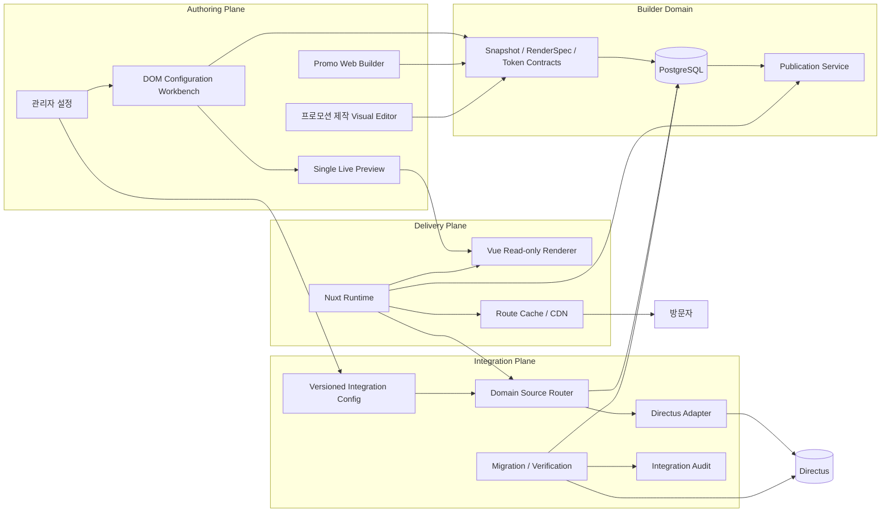
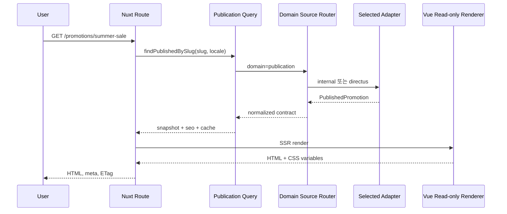
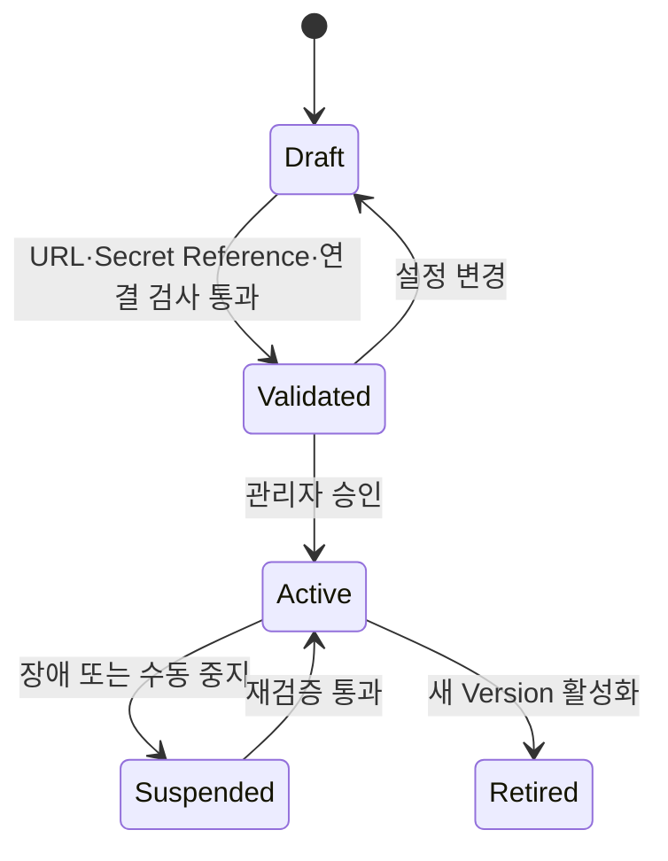
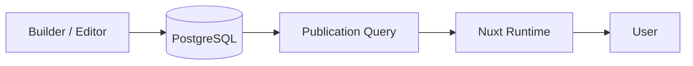
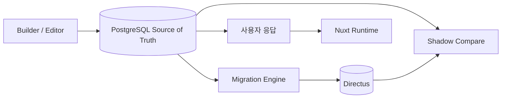
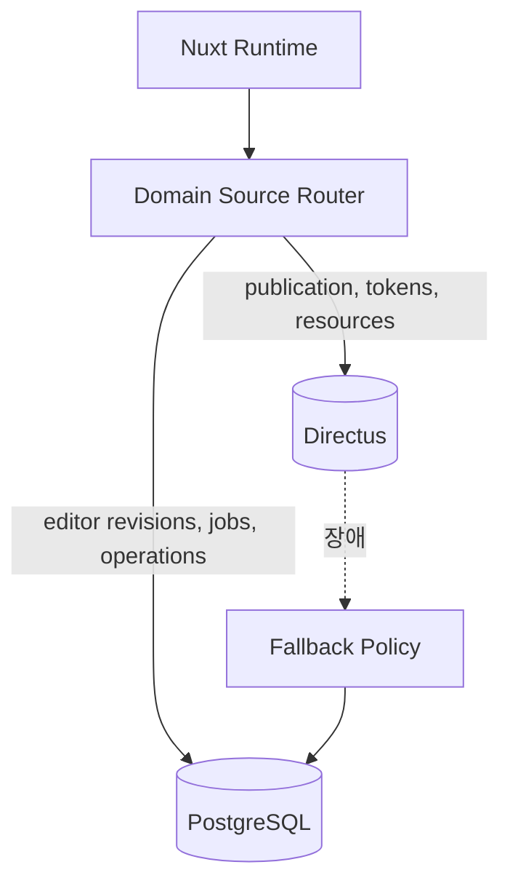

# Nuxt Runtime, 관리자 DOM 구성 편집 및 Directus 연결 Tunnel 개발 계획서

## 0. 문서 정보

- 작성일: 2026-09-17
- 대상 프로젝트: `promo_web_builder`
- 문서 상태: 개발 계획 초안
- 목표 1: 현재 Snapshot·RenderSpec·Design Token 계약을 유지하면서 Nuxt에서 프로모션을 네이티브 렌더링할 수 있게 한다.
- 목표 2: 관리자에서 Component·Section을 구성할 때 별도 Visual Editor 대신 DOM Tree·속성 편집·단일 Live Preview를 사용한다.
- 목표 3: Directus는 상세 데이터 연동 전에 연결 가능한 안전한 Tunnel과 Config까지만 제공한다.
- 전제: Nuxt 도입은 Directus 준비 여부와 무관하게 진행할 수 있어야 한다.
- 전제: Directus가 연결되기 전까지 현재 PostgreSQL이 Source of Truth다.
- 전제: 실제 프로모션 페이지를 제작하는 Visual Editor는 유지한다.

### 0.1 1차 구현 범위 조정

2026-09-17 협의에 따라 1차 구현에서 Directus는 **연결 가능한 터널**까지만 제공한다.

1차 포함 범위:

- Directus 기능 Master Flag
- 환경별 Base URL, 인증 `secretRef`, Timeout Config
- Config Draft·Validate·Activate·Suspend
- 서버 전용 Directus HTTP Client Factory
- Health·인증 연결 테스트
- 연결 상태, 최근 검사 시각, 오류 코드 표시
- 향후 Adapter가 사용할 Port와 Tunnel Interface
- 기능 OFF, 미설정, 연결 실패 시 Fail-closed 처리

후속 협의 전까지 제외:

- Collection·Field·Relation Manifest 확정 및 자동 생성
- 데이터 범위와 필드 Mapping
- Dry Run, Batch Migration, 증분 Migration
- Shadow Read와 데이터 Diff
- Runtime Read/Write 전환
- Files 이전과 Asset 동기화
- Cutover·Rollback 실행

문서의 상세 Directus 설계는 후속 단계의 방향을 보존하기 위한 참고안이며, `DIC-02` 이후는 1차 구현 승인 범위가 아니다.

## 1. 현행 기준선

현재 프로젝트에는 다음 기반이 이미 존재한다.

- Vue 3 기반 Visual Editor와 `PromoPageRenderer`
- 프로모션 Document Snapshot과 Revision
- Component Registry, Component Version, RenderSpec v1
- Design Token Definition·Set·Version·Value
- 공용 Preview·Web Output 데이터 계약
- HTML·Snapshot·Manifest·Vue·React Export
- Export 품질 Gate와 Dependency Manifest
- 관리자 Feature Flag 조회 기능
- Prompt, Worker, Component, Section, Locale, Content Resource 관리 기능

현재 Vue Export는 완성된 HTML을 `iframe srcdoc`에 넣는 호환 방식이다. Nuxt 페이지에서 실행할 수는 있지만 다음 Nuxt 기능은 직접 사용하지 못한다.

- SSR과 Hydration
- 페이지별 SEO Meta와 Open Graph
- Nuxt Image 최적화
- Nuxt Route와 Middleware
- 정적 생성과 Route Cache
- 애플리케이션 공통 Header·Footer·Analytics

따라서 전체 빌더를 Nuxt로 다시 작성하지 않고, 출력 전용 Renderer를 분리해 Nuxt Runtime이 직접 사용하도록 개편한다.

## 2. 최종 목표 구조



### 2.1 계층별 책임

| 계층 | 책임 | Directus 의존 여부 |
|---|---|---:|
| Builder Domain Contract | Snapshot, RenderSpec, Token, Publication 계약 | 없음 |
| 프로모션 제작 Visual Editor | 실제 페이지 구성, 선택, Drag, Resize, 콘텐츠 편집 | 없음 |
| DOM Configuration Workbench | 관리자 Component·Section 구조와 정책 편집 | 없음 |
| Single Live Preview | Component·Section 설정 결과의 공용 미리보기 | 없음 |
| Publication Service | 게시 Revision 고정, Slug, 공개 상태 관리 | 없음 |
| Nuxt Runtime | SSR/CSR/SSG 출력, SEO, Route, Cache | 없음 |
| Integration Config | 도메인별 연결·조회·마이그레이션 정책 | Directus 기능을 켤 때만 |
| Directus Adapter | Directus API 호출과 응답 정규화 | 있음 |
| Migration Engine | 기존 DB → Directus 이전·검증 | 있음 |

## 3. 핵심 설계 결정

### 3.1 Nuxt와 Directus 분리

Nuxt는 `PublishedPromotion` 계약만 사용한다. 데이터가 PostgreSQL에서 왔는지 Directus에서 왔는지 알지 못한다.

```text
Nuxt Route
→ Publication Query Port
→ Domain Source Router
→ Internal Adapter 또는 Directus Adapter
→ 동일한 PublishedPromotion 반환
→ Read-only Renderer
```

이 구조를 통해 다음 운영이 가능하다.

- Directus 없이 Nuxt 먼저 배포
- 특정 도메인만 Directus Shadow Read
- Directus 장애 시 내부 DB로 즉시 복귀
- Nuxt 코드를 변경하지 않고 조회 원본 전환

### 3.2 편집과 출력 Renderer 분리

현재 `PromoPageRenderer.vue`의 책임을 다음과 같이 나눈다.

| 모듈 | 책임 |
|---|---|
| `renderer-core` | Snapshot 정규화, Token 해석, RenderSpec 검증, View Model 생성 |
| `vue-readonly-renderer` | 게시 페이지 DOM 출력 |
| `vue-editor-interactions` | 선택, Drag, Resize, Contenteditable, Inspector Event |
| `nuxt-runtime` | Route, Server Fetch, SEO, Cache, 오류 페이지 |

`vue-readonly-renderer`는 SSR 환경에서 `window`와 `document` 없이 최초 렌더가 가능해야 한다. Motion, Visibility, Pointer Event처럼 브라우저가 필요한 동작은 Hydration 이후 Client Enhancement로 연결한다.

### 3.3 관리자 구성 편집과 프로모션 제작 분리

관리자 설정의 Component·Section 관리는 자유 배치 Canvas를 사용하지 않는다.

```text
관리자 Component·Section 관리
→ DOM Tree / 구성 목록
→ 선택 노드 속성
→ Field·Token·Layout·Responsive 설정
→ Single Live Preview
→ Validate
→ Draft 저장·활성화
```

실제 프로모션 제작은 기존 Visual Editor를 유지한다.

```text
프로모션 제작 Visual Editor
→ Section·Component 배치
→ Drag·Resize·콘텐츠 편집
→ 페이지 전체 Preview
→ 저장·Revision·Web Output
```

두 화면은 동일한 `vue-readonly-renderer`와 Token Resolver를 사용하되 편집 Interaction만 다르게 연결한다.

### 3.4 Config 우선순위

기능 활성 여부는 다음 순서로 결정한다.

```text
환경변수 Master Kill Switch
→ 활성 Integration Config Version
→ 도메인별 Capability Policy
→ 연결·권한·Schema Health
→ 요청 시점 Fallback 정책
```

- 환경변수는 긴급 차단과 배포 단위 기능 노출에만 사용한다.
- 상세 URL, 정책, 도메인 선택, Timeout, Mapping Version은 DB의 Versioned Config로 관리한다.
- Secret 원문은 환경변수 또는 Secret Store에 두고 Config에는 `secretRef`만 저장한다.
- 화면 입력만으로 Master Kill Switch를 우회할 수 없다.

## 4. Nuxt 대응 상세 설계

### 4.1 목표 디렉터리

초기에는 Monorepo 전면 전환 없이 현재 저장소 안에서 경계를 만든다.

```text
packages/
├─ promo-contracts/
│  ├─ snapshot
│  ├─ render-spec
│  ├─ publication
│  └─ integration-config
├─ renderer-core/
└─ vue-readonly-renderer/

apps/
└─ promo-runtime-nuxt/
   ├─ pages/promotions/[slug].vue
   ├─ components/PromoRuntimePage.vue
   ├─ server/api/promotions/[slug].get.ts
   ├─ server/services/publication-source.ts
   └─ nuxt.config.ts
```

기존 Vite Visual Editor는 유지한다. 공용 계약과 Read-only Renderer만 단계적으로 이동한다.

### 4.2 PublishedPromotion 계약

Nuxt Runtime은 DB 행이나 Directus 응답을 직접 받지 않고 다음 정규화 결과를 받는다.

```json
{
  "contractVersion": 1,
  "publication": {
    "id": "publication-id",
    "slug": "summer-sale",
    "locale": "ko-KR",
    "status": "published",
    "publishedRevision": 12,
    "publishedAt": "2026-09-17T00:00:00.000Z"
  },
  "seo": {
    "title": "프로모션 제목",
    "description": "프로모션 설명",
    "imageUrl": "https://..."
  },
  "snapshot": {},
  "manifest": {},
  "cache": {
    "etag": "sha256:...",
    "revalidateSeconds": 300
  }
}
```

### 4.3 Nuxt 렌더링 모드

| 모드 | 용도 | 1차 적용 |
|---|---|---:|
| CSR | 관리자 미리보기, 인증된 Preview | 유지 |
| SSR | 공개 프로모션, SEO가 필요한 페이지 | 적용 |
| SSG/Prerender | 종료 시점까지 변경이 적은 캠페인 | 후속 적용 |
| ISR/SWR Cache | 게시 후 간헐적으로 수정되는 페이지 | 적용 검토 |

### 4.4 SSR 안전화 규칙

- Module Scope와 `setup()` 최초 실행에서 `window`, `document`, `localStorage`를 사용하지 않는다.
- `onMounted`, `.client.ts`, `<ClientOnly>`는 편집·Motion·측정 등 브라우저 전용 기능에만 사용한다.
- 최초 SSR DOM과 Hydration DOM이 동일하도록 Random, 현재 시각, Viewport 의존 분기를 제거한다.
- Token → CSS Variable 결과를 서버와 클라이언트에서 동일하게 계산한다.
- 공개 페이지에서는 편집용 Drag, Resize, Selection, Contenteditable 코드를 번들에서 제외한다.
- RenderSpec Allowlist와 Sanitizer는 서버와 클라이언트에서 동일한 계약 버전을 사용한다.

### 4.5 Nuxt 출력 흐름



### 4.6 기존 Export와 호환

- `html`, `snapshot`, `manifest`, `vue`, `react` 형식은 즉시 제거하지 않는다.
- 신규 `nuxt` Export는 iframe 소스가 아니라 Snapshot·Manifest와 설치 안내를 제공한다.
- Nuxt Runtime이 같은 저장소에 배포되는 경우 파일 Export보다 Publication API 조회를 기본으로 한다.
- 기존 iframe Vue Export는 `legacy`로 표시하고 일정 기간 Rollback 경로로 유지한다.

### 4.7 관리자 DOM Configuration Workbench

관리자 Component·Section 화면은 다음 공용 Shell을 사용한다.

```text
┌────────────────────┬───────────────────────────┐
│ DOM/구성 Tree      │ Single Live Preview       │
│                    │                           │
│ article            │ Component 또는 Section   │
│ ├─ image           │ 결과를 한 곳에서 표시    │
│ ├─ div             │                           │
│ │  ├─ heading      │ Desktop / Tablet / Mobile │
│ │  └─ text         │                           │
│ └─ button          │                           │
├────────────────────┴───────────────────────────┤
│ 선택 노드 속성: Field · Token · Layout · A11y │
└────────────────────────────────────────────────┘
```

#### Component 관리

- RenderSpec DOM Tree 탐색
- 허용 Node 추가·복제·이동·삭제
- `fieldKey` Binding
- Design Token Binding
- Flex·Grid·정렬·간격
- Desktop·Tablet·Mobile Override
- 이미지 비율·Object Fit
- CTA와 접근성 속성
- Validator 오류 위치 이동

#### Section 관리

- 허용 Component 목록
- Component 순서, 필수 여부, 최소·최대 개수
- Section 역할과 Layout Policy
- 기본 Token·Spacing·Responsive Rule
- 샘플 Component Instance로 Section Preview

#### Single Live Preview

- `component`, `section` 두 Preview Mode
- Desktop·Tablet·Mobile Viewport
- 샘플 데이터와 Token Set 교체
- Tree 선택 ↔ Preview 요소 선택 동기화
- Validation Error Node 강조
- 이미지 분석 원본과 생성 결과 비교

#### 제거·비활성 대상

- 관리자 Component 전용 자유 배치 Canvas
- 관리자 Section 전용 자유 배치 Canvas
- 화면마다 중복된 Preview Renderer
- 관리자용 Drag·Resize Interaction
- 비활성 Template·Layout 관리와 연결된 편집기

관리자 화면에서도 자유 배치 Geometry가 필요한 예외는 Canvas를 다시 만들지 않고 속성 패널의 `x`, `y`, 너비, 높이 값과 Preview Overlay로 조정한다.

### 4.8 유지 대상

- 실제 프로모션 제작 Visual Editor
- RenderSpec Validator와 Sanitizer
- DOM Tree Editor와 Field Binding
- Design Token 연결
- 반응형 설정
- Draft·Validate·Activate Lifecycle
- Component·Section Version과 변경 이력
- 공용 Read-only Renderer

## 5. Directus 필요·선택·불필요 영역

### 5.1 구분 기준

- `필수`: Directus를 운영 콘텐츠 원본으로 사용할 때 연결해야 하는 데이터
- `선택`: Directus에서 운영하면 편리하지만 빌더 자체 기능에는 필요하지 않은 데이터
- `제외`: 실행 중 상태이거나 내부 편집·복구를 위한 데이터로 Directus 연동 이익보다 복잡성과 위험이 큰 데이터

| 도메인 | 구분 | Directus에서 맡길 역할 | 현재 시스템 역할 |
|---|---:|---|---|
| Publication·Slug·SEO | 필수 | 공개 상태, URL, 게시 Revision, SEO | 작성·게시 계약 생성 |
| 게시 Snapshot | 필수 | Nuxt가 읽는 고정 게시 데이터 | 편집 Snapshot과 Revision 생성 |
| Component Definition·활성 Version | 필수 | 운영 컴포넌트 카탈로그 | Draft·검증·활성화 |
| Component RenderSpec | 필수 | 게시 컴포넌트 구조 제공 | 생성·보안 검증·Hash 생성 |
| 활성 Design Token Version | 필수 | Runtime Theme 제공 | Draft·검증·활성화 |
| Content Resource·Locale | 필수 | 운영 문구·다국어 콘텐츠 제공 | 편집과 참조 무결성 관리 |
| Asset Metadata·File ID | 필수 | 운영 이미지 조회와 권한 관리 | 생성·업로드·Hash 검증 |
| Section Definition·Preset | 선택 | 편집자가 사용할 카탈로그 | 현재 빌더에서 계속 관리 가능 |
| Prompt Template·Version | 선택 | 운영 설정 중앙화 | LLM 실행 원본과 Snapshot 고정 |
| Worker 설정 | 선택 | 비밀값이 아닌 정책 정보 | 실제 실행·Secret 해석 |
| Motion Preset | 선택 | 운영 Preset 카탈로그 | Renderer 적용 |
| 디자인 참고 문서·분석 결과 | 선택 | 검색·관리 | AI 입력과 추적 |
| Template·Layout 관리 | 제외/보관 | 현재 UI 비활성, 필요 시 Archive만 | Section Preset으로 대체 |
| 편집 중 Document Revision | 제외 | Directus에 실시간 이전하지 않음 | PostgreSQL에서 일관성·충돌 관리 |
| Undo/Redo·Selection·Workspace 상태 | 제외 | 브라우저·편집 세션 상태 | Editor 전용 |
| Composition Proposal | 제외 | 임시 제안 데이터 | 승인 전 Builder 내부 관리 |
| Generation Run·Job·Retry | 제외 | 실행 상태를 CMS에 두지 않음 | Worker·운영 DB 관리 |
| Lease·Heartbeat·Queue Cursor | 제외 | CMS 데이터가 아님 | 실행 인프라 관리 |
| 전체 Operation Event 원문 | 제외/Archive | 필요 시 요약본만 이관 | 감사·장애 복구 |
| API Key·Token·Webhook Secret | 절대 제외 | `secretRef`만 저장 | Secret Store에서 관리 |

### 5.2 중요한 운영 원칙

- 편집 중 문서는 PostgreSQL, 게시된 고정 Revision은 Publication Adapter를 통해 제공한다.
- Directus를 사용하더라도 AI Job과 편집 트랜잭션 DB로 사용하지 않는다.
- Directus 응답 형식을 Nuxt와 Visual Editor가 직접 참조하지 않는다.
- Files 바이너리 이전은 메타데이터·Checksum 검증 이후 별도 단계로 실행한다.
- 현재 비활성화된 Template·Layout 관리 데이터는 기본 마이그레이션 범위에서 제외한다.

## 6. Integration Config 설계

### 6.1 Master Feature Flag

`api/_promo-builder-flags.js`에 다음 배포 단위 Flag를 추가한다.

| 환경변수 | 기본값 | 역할 |
|---|---:|---|
| `NUXT_RUNTIME_ENABLED` | `false` | Nuxt Runtime Route와 Export 노출 |
| `NUXT_SSR_ENABLED` | `false` | 공개 페이지 SSR 활성화 |
| `ADMIN_DOM_CONFIG_WORKBENCH_ENABLED` | `false` | 관리자 DOM Tree·단일 Preview Workbench 노출 |
| `ADMIN_LEGACY_VISUAL_CONFIG_EDITOR_ENABLED` | `true` | 전환 기간의 기존 관리자 Canvas Rollback |
| `DIRECTUS_INTEGRATION_ENABLED` | `false` | Directus 설정·연결 기능의 Master Switch |
| `DIRECTUS_CONNECTION_TUNNEL_ENABLED` | `false` | 서버 전용 연결 테스트와 Client Tunnel 허용 |

`DIRECTUS_MIGRATION_ENABLED`, `DIRECTUS_SHADOW_READ_ENABLED`, `DIRECTUS_RUNTIME_READ_ENABLED`, `DIRECTUS_RUNTIME_WRITE_ENABLED`는 후속 협의에서 의미와 승인 조건을 확정한 뒤 추가한다. 1차 구현에서는 환경변수와 화면 모두 제공하지 않는다.

환경변수가 꺼져 있으면 DB Config가 활성 상태여도 기능을 실행하지 않는다.

### 6.2 Versioned Config 모델

기존 Directus 계획의 `integration_configs`, `integration_config_versions`를 사용하되 1차에는 연결에 필요한 최소 필드만 저장한다.

```json
{
  "provider": "directus",
  "environment": "staging",
  "status": "active",
  "endpoint": {
    "baseUrl": "https://directus.example.com",
    "readerSecretRef": "directus/staging/connection-reader"
  },
  "capabilities": {
    "connectionTest": true
  },
  "policies": {
    "timeoutMs": 5000,
    "retryCount": 1,
    "followRedirects": false
  }
}
```

Writer·Schema Admin Secret, Domain Policy, Mapping Version은 후속 협의 후 새 Config Version 필드로 추가한다. 1차 DB에 의미가 확정되지 않은 빈 필드를 미리 만들지 않는다.

### 6.3 Config 상태



- 수정은 활성 Version을 직접 바꾸지 않고 새 Draft Version을 만든다.
- 활성화 전 URL 정책, Secret Reference 해석, Health·인증 연결을 검증한다.
- Active 상태는 Tunnel 사용 가능을 뜻하며 Runtime 데이터 조회 전환을 의미하지 않는다.
- 모든 활성화·중지·전환은 사용자와 사유를 감사 로그에 남긴다.

### 6.4 Connection Tunnel Port

1차에는 도메인 Repository를 구현하지 않고 서버 전용 연결 Port만 제공한다.

```text
DirectusConnectionPort
├─ testConnection()
├─ getServerInfo()
└─ close()
```

실제 데이터 API는 Tunnel Port를 직접 확장하지 않고 후속 Adapter가 주입받아 사용한다.

```text
DirectusConnectionPort
→ Future DirectusPublicationAdapter
→ Future DirectusComponentAdapter
→ Future DirectusTokenAdapter
```

Collection 경로와 응답 형태는 1차 Tunnel에 하드코딩하지 않는다.

### 6.5 설정 화면

```text
설정
└─ 외부 연동
   └─ Directus
      ├─ 기능 상태
      ├─ 연결 설정
      ├─ 연결 테스트
      └─ 연결 이력·감사 로그
```

화면에서 다음 상태를 명확히 구분한다.

- 배포 환경에서 기능 자체가 꺼짐
- Config가 작성되지 않음
- Secret Reference를 해석할 수 없음
- 연결 검사 중
- 연결 성공
- 인증 실패 또는 연결 실패

사용 도메인, Collection 매핑, Migration, Shadow Read, 조회 전환 화면은 후속 협의 전에는 노출하지 않는다.

## 7. 적용 구성도

### 7.1 Directus 미사용



### 7.2 Directus 준비·검증 중



### 7.3 도메인별 전환 후



## 8. 개발 Workstream

## NDX-00. 기준선·ADR 확정 — P0

### 작업

- Snapshot, RenderSpec, Token, Export Contract Version 고정
- 공개 페이지 URL·Locale·게시 Revision 규칙 결정
- Nuxt Runtime과 Directus Adapter 경계를 ADR로 기록
- 기존 Preview와 Export Fixture를 회귀 기준으로 고정

### 완료 조건

- Nuxt와 Directus가 동일한 Domain Contract를 사용한다.
- 기존 Vite Editor를 변경하지 않고 Nuxt 개발을 시작할 수 있다.

## NDX-01. 공용 Contract·Renderer Core 분리 — P0

### 작업

- Snapshot 정규화와 공개 필드 필터를 공용 모듈로 이동
- RenderSpec Validator·Runtime Token Resolver의 브라우저 의존 제거
- Editor Event 없이 동작하는 Read-only View Model 구성
- 기존 Import 경로를 Compatibility Wrapper로 유지

### 완료 조건

- Node 환경에서 Snapshot → View Model 테스트가 통과한다.
- Visual Editor와 기존 Web Output 회귀가 없다.

## NDX-02. Vue Read-only Renderer SSR 안전화 — P0

### 작업

- 편집 Interaction을 별도 모듈로 분리
- `window`, `document`, Pointer, Visibility 처리를 Client Enhancement로 이동
- Server/Client Token CSS 결과 일치
- Motion 비활성 SSR Fixture와 Hydration Fixture 추가

### 완료 조건

- 공개 Renderer가 DOM 전역 없이 서버에서 렌더링된다.
- Hydration Warning이 0건이다.
- 편집용 코드가 공개 번들에 포함되지 않는다.

## NDX-03. Nuxt Runtime 구축 — P0

### 작업

- `apps/promo-runtime-nuxt` 생성
- `/promotions/[slug]`와 Locale Route 구현
- Publication Query Port와 Internal Adapter 구현
- SEO, Open Graph, Canonical, 404/410 처리
- ETag, Cache Header, Preview Bypass 구현
- Error Boundary와 Legacy HTML Fallback 제공

### 완료 조건

- Directus 없이 내부 DB 데이터로 SSR 페이지가 표시된다.
- Desktop·Mobile에서 기존 Web Output과 동일한 핵심 DOM·Token 결과를 보인다.

## NDX-04. Nuxt Export·배포 계약 — P1

### 작업

- `nuxt` Export Format과 Dependency Manifest 확장
- Nuxt Runtime Version과 Contract 호환성 검사
- 게시·재게시·Rollback 시 Cache Invalidation Hook 정의
- Vercel/Node 배포 환경의 Runtime Config 정의

### 완료 조건

- 호환되지 않는 Contract는 게시 전에 차단된다.
- 게시 Revision 변경 후 정해진 시간 안에 Nuxt 페이지가 갱신된다.

## ACW-00. 관리자 편집기 현황 분류 — P0

### 작업

- Component, Section, Template·Layout 관리자 화면의 Editor·Preview 진입점 목록화
- 실제 프로모션 제작 Visual Editor와 공유하는 코드 식별
- `유지`, `공용 Workbench로 이동`, `비활성`, `제거 후보`로 분류
- 현재 Component·Section 저장 Contract와 권한 회귀 기준 고정

### 완료 조건

- 관리자 Editor를 정리해도 프로모션 제작 Visual Editor가 영향을 받지 않는 경계가 문서와 테스트로 고정된다.
- 기존 Draft·Activate·Version 데이터 계약을 그대로 사용할 수 있다.

## ACW-01. 공용 DOM Tree·Inspector — P0

### 작업

- RenderSpec Tree 탐색과 노드 선택 상태를 공용 모듈로 분리
- 허용 Node 추가·복제·이동·삭제 Command 구현
- Field·Token·Layout·Responsive·A11y 속성 Inspector 통합
- Validator 진단 경로와 Tree Node 선택 연결
- Raw HTML·CSS·JavaScript 입력 차단 유지

### 완료 조건

- Component를 Canvas 없이 DOM Tree와 속성 패널만으로 생성·수정할 수 있다.
- 잘못된 RenderSpec은 Draft 저장 또는 활성화 단계에서 차단된다.

## ACW-02. Single Live Preview — P0

### 작업

- Component·Section이 공유하는 `PreviewHost` 구현
- 공용 Read-only Renderer 연결
- Component·Section Mode와 Viewport 전환
- 샘플 데이터·Token Set 변경
- Tree와 Preview 선택 양방향 동기화
- Validation Error Overlay와 이미지 분석 비교 Mode 구현

### 완료 조건

- 관리자 화면에서 동시에 하나의 Preview Renderer만 실행된다.
- Preview와 Nuxt·Web Output이 같은 RenderSpec·Token 결과를 사용한다.

## ACW-03. Section 구성 전환·중복 Editor 비활성화 — P1

### 작업

- Section 허용 Component·순서·필수·개수·Layout Policy 편집을 Workbench로 이동
- 자유 배치 예외는 Geometry Inspector와 Preview Overlay로 제공
- 기존 관리자 Component·Section Canvas 진입점 Feature Flag 처리
- Template·Layout 관리 비활성 정책과 충돌 제거
- 안정화 후 중복 Preview와 관리자 전용 Interaction 삭제 후보 기록

### 완료 조건

- 관리자에서 Component와 Section 설정이 동일한 Workbench를 사용한다.
- 프로모션 제작 Visual Editor의 Drag·Resize·페이지 편집 기능은 유지된다.
- Feature Flag를 통해 기존 관리자 화면으로 한시적 Rollback이 가능하다.

## DIC-00. Integration Config 기반 — P0

### 작업

- Directus·Nuxt Master Flag 추가
- `integration_configs`, Version, Audit Migration 추가
- Secret Reference Contract와 Masking 구현
- Config Draft·Validate·Activate·Suspend API 구현
- Config Validation 결과와 활성 Version Snapshot 저장

### 완료 조건

- Directus 서버가 없어도 기능이 기본 OFF 상태로 안전하게 배포된다.
- Secret 원문이 DB, 응답, 로그에 노출되지 않는다.

## DIC-01. Directus 연결 Tunnel — P0

### 작업

- Health, Version, 인증 연결 검사
- 환경별 Base URL, Reader Secret Reference, Timeout 설정
- 서버 전용 HTTP Client Factory와 표준 오류 계약
- Host Allowlist, HTTPS, Redirect, Timeout, Response Size 보호
- 연결 성공 여부와 최근 검사 결과 저장
- 실제 Directus가 없을 때 Contract Mock Server 테스트 제공

### 완료 조건

- 관리자 설정에서 연결 성공과 실패 원인을 확인할 수 있다.
- Directus Token 원문이 브라우저, DB, 로그에 노출되지 않는다.
- 연결 성공이 데이터 Migration이나 Runtime 전환을 자동 실행하지 않는다.

## DIC-02. 도메인 Capability·Source Router — 후속 협의

### 작업

- Domain Policy Schema와 관리자 UI 구현
- Internal Adapter Port 도입
- Directus Adapter의 응답 정규화
- Shadow Compare Adapter와 Diff 저장
- Circuit Breaker와 Internal Fallback 구현

### 완료 조건

- 도메인마다 `disabled`, `internal`, `shadow`, `directus`를 독립 선택할 수 있다.
- Directus 장애가 Builder 편집과 공개 페이지 전체 장애로 확산되지 않는다.

## DIC-03. 필수 도메인 마이그레이션 — 후속 협의

### 적용 순서

1. Component Definition·Version·RenderSpec
2. Design Token Definition·Set·Version·Value
3. Locale·Content Resource
4. Asset Metadata
5. Publication·Published Snapshot·SEO

### 작업

- Mapping Manifest와 Checksum 작성
- Dry Run, `planHash`, 승인, Batch, Checkpoint 구현
- Source Key와 Source Hash 기반 멱등성 구현
- 관계·건수·Hash·샘플 Render 검증
- 증분 Migration과 삭제 비활성화 정책 구현

### 완료 조건

- 동일 계획 재실행 시 중복 데이터가 생성되지 않는다.
- 원본과 대상의 PublishedPromotion 결과가 동일하다.

## DIC-04. Shadow Read·Cutover·Rollback — 후속 협의

### 작업

- 최소 검증 기간과 허용 Diff 기준 설정
- 도메인별 Cutover 승인 API
- Active Config Version과 Cutover Snapshot 고정
- 오류율·Latency·Fallback 횟수 모니터링
- 즉시 내부 DB 복귀 기능 구현

### 완료 조건

- Nuxt 코드 배포 없이 데이터 원본을 전환할 수 있다.
- 복구 후 기존 게시 페이지가 정상적으로 유지된다.

## 9. 단계별 일정 제안

Directus 설정이 아직 준비되지 않은 상태를 고려해 1차는 Nuxt 기능과 Directus 연결 Tunnel까지만 구현한다.

| 1차 단계 | Codex 예상 | 주요 결과 | 실제 Directus 필요 |
|---|---:|---|---:|
| 0. 기준선·Contract | 120~180분 | Contract와 경계 확정 | 아니오 |
| 1. Renderer Core·SSR 분리 | 300~540분 | SSR 가능한 Read-only Renderer | 아니오 |
| 2. Nuxt Runtime·게시 기능 | 300~540분 | 내부 DB 기반 Nuxt SSR 출력 | 아니오 |
| 3. 관리자 DOM Workbench | 240~420분 | DOM Tree·Inspector 통합 | 아니오 |
| 4. Single Live Preview | 180~300분 | Component·Section 공용 Preview | 아니오 |
| 5. 관리자 Section 전환 | 180~300분 | 중복 Canvas 비활성화 | 아니오 |
| 6. Config·Secret Reference | 180~300분 | 설정 탭과 기본 OFF 제어 | Mock 가능 |
| 7. Directus Connection Tunnel | 180~300분 | Health·인증 연결과 Client Factory | 검증 시에만 필요 |
| 8. 회귀·E2E·오류 수정 | 300~540분 | Nuxt·Workbench·Tunnel 품질 검증 | Mock 가능 |

1차 전체는 Codex 작업 기준 약 `1,980~3,420분`(33~57시간)으로 예상한다. 실제 Directus가 준비되지 않아도 Mock Contract로 구현과 자동 테스트를 완료하고 기능을 OFF 상태로 배포할 수 있다. 실제 URL과 Reader Token이 제공되면 연결 확인에 별도 `30~90분`을 잡는다.

후속 협의 대상인 Schema Mapping, Migration, Shadow Read, Cutover는 이 일정에 포함하지 않는다.

## 10. 테스트 전략

### 10.1 Nuxt

- Snapshot Contract Unit Test
- RenderSpec SSR Unit Test
- Server HTML과 Hydration DOM 비교
- 1440, 1024, 390, 360 Screenshot Regression
- SEO Meta, Canonical, Open Graph 검사
- 404, 410, Preview Token, Locale Route 검사
- 기존 Preview·HTML Export·Nuxt 출력 비교
- 공개 번들에 Editor Interaction 미포함 검사

### 10.2 관리자 DOM Workbench

- DOM Node 추가·복제·이동·삭제 Command 테스트
- Field Binding과 Token Binding 보존 테스트
- 잘못된 Node·속성·JavaScript 차단 테스트
- Tree 선택과 Preview 선택 양방향 동기화 테스트
- Component·Section Preview Mode 전환 테스트
- Desktop·Tablet·Mobile Preview 회귀 테스트
- 동일 입력에 대한 관리자 Preview·Web Output·Nuxt DOM 비교
- 관리자 Canvas 비활성화 후 기존 Draft·Version·Activate 회귀 테스트
- 실제 프로모션 제작 Visual Editor Drag·Resize·저장 회귀 테스트

### 10.3 Directus Config

- Master Flag OFF Fail-closed 테스트
- Secret Masking과 로그 누출 검사
- Config Version Lifecycle 테스트
- 잘못된 URL, 401, 403, Timeout, 429, 5xx 테스트
- Redirect 차단, Response Size, 허용 Host 정책 테스트
- 연결 성공이 데이터 조회·쓰기 요청을 발생시키지 않는지 검사

### 10.4 후속 테스트 범위

- Schema Diff, Domain Routing, Migration, Shadow Read, Cutover 테스트는 후속 계획에서 정의한다.
- 1차 CI에는 비어 있는 Migration·Routing 테스트나 Placeholder 성공 테스트를 추가하지 않는다.

## 11. 보안·운영 기준

- Directus URL은 `https`만 허용하고 Private Network 접근 정책을 별도로 둔다.
- Token은 브라우저로 반환하지 않는다.
- 1차 연결 Token은 최소 Read 권한만 가지며 Collection 쓰기 권한을 부여하지 않는다.
- Migration Writer와 Schema Admin Token은 1차에서 설정하거나 사용하지 않는다.
- Tunnel은 임의 Collection Path를 전달하는 범용 Proxy로 만들지 않는다.
- 공개 Snapshot에서 내부 Prompt, 운영 로그, 사용자 정보, Secret Reference를 제거한다.
- Config 활성화와 연결 테스트 권한을 일반 편집 권한과 분리한다.
- 연결 실패가 현재 PostgreSQL 기반 Builder와 Nuxt Runtime에 영향을 주지 않게 한다.

## 12. 주요 위험과 대응

| 위험 | 영향 | 대응 |
|---|---|---|
| Renderer에 편집 코드가 강하게 결합 | SSR 분리가 지연됨 | Read-only 경계를 먼저 만들고 Compatibility Wrapper 유지 |
| 관리자 Canvas 제거가 제작 Editor에 영향 | 페이지 편집 기능 회귀 | 관리자 Workbench와 제작 Editor 진입점·Interaction 번들을 분리 |
| DOM Tree만으로 자유 배치 조정이 불편 | 관리자 설정 작업성 저하 | Geometry Inspector와 선택 Overlay 제공, Canvas 전체 복원은 하지 않음 |
| 공용 Preview 상태가 화면별로 오염 | 잘못된 저장·미리보기 | Preview Session을 Component·Section 단위로 초기화하고 저장 상태와 분리 |
| SSR/Client DOM 차이 | Hydration 오류 | 결정적 View Model과 고정 Fixture 비교 |
| Directus 응답 형식이 화면으로 누출 | 교체·복구 어려움 | Port/Adapter와 Domain Contract 강제 |
| Config와 환경변수 판정 충돌 | 의도치 않은 활성화 | Master Flag 우선, 서버 평가 결과만 UI에 제공 |
| 연결 Tunnel이 데이터 Proxy로 확대됨 | 범위 확장·데이터 유실 | 1차 Tunnel은 Health·인증 검사만 허용하고 데이터 Read/Write를 차단 |
| Directus 장애가 공개 페이지 장애로 확대 | 서비스 중단 | Cache, Circuit Breaker, Internal Fallback |
| 비활성 Template 데이터까지 이전 | 비용·복잡도 증가 | 기본 범위 제외, 별도 Archive 선택 |
| Asset ID와 URL 불일치 | 이미지 깨짐 | Checksum·Source Key·File Mapping 검증 |

## 13. 완료 정의

### Nuxt 대응 완료

- 공개 프로모션을 iframe 없이 Nuxt SSR로 출력한다.
- 기존 Snapshot과 RenderSpec을 다시 작성하지 않는다.
- Preview와 Nuxt 출력의 핵심 DOM·Token·반응형 결과가 일치한다.
- SEO, Locale, Cache, 404/410, Revision 고정이 동작한다.
- Directus가 없어도 정상 운영된다.

### 관리자 DOM 구성 편집 완료

- Component와 Section을 별도 관리자 Canvas 없이 구성할 수 있다.
- DOM Tree, 속성 Inspector, 단일 Live Preview가 동일한 선택 상태를 공유한다.
- Component·Section Preview는 같은 Read-only Renderer를 사용한다.
- Desktop·Tablet·Mobile 결과와 Validation Error를 한 Preview에서 확인할 수 있다.
- 실제 프로모션 제작 Visual Editor의 Drag·Resize·콘텐츠 편집은 유지된다.
- 기존 관리자 Canvas는 Feature Flag로 비활성화되며 Rollback 경로가 남는다.

### Directus Connection Tunnel 완료

- 설정에서 기능 OFF, 미설정, 연결 성공, 연결 실패 상태를 구분할 수 있다.
- 환경별 URL·Secret Reference·Timeout을 Version으로 관리할 수 있다.
- 서버가 Directus Health·인증 요청을 안전하게 수행할 수 있다.
- Secret 원문을 저장하거나 노출하지 않는다.
- 연결 성공만으로 Collection 생성, 데이터 이전, Runtime 전환이 발생하지 않는다.
- 후속 Adapter가 사용할 Client Port가 마련되지만 도메인 데이터는 아직 통과시키지 않는다.

## 14. 최종 권장 실행 순서

```text
1. Domain Contract 고정
2. Read-only Renderer 분리
3. 관리자 DOM Tree·Inspector 공용화
4. Component·Section Single Live Preview 적용
5. 관리자 전용 중복 Canvas를 Feature Flag로 비활성화
6. Nuxt SSR Runtime을 내부 DB로 완성
7. Integration Config와 Master Flag를 기본 OFF로 배포
8. Directus Connection Tunnel과 Mock Contract 구현
9. 전체 회귀·E2E 후 관리자 화면 Rollout
10. 실제 Directus 준비 후 Health·인증 연결 확인
11. 상세 Collection·Mapping·Migration 범위 협의
```

Nuxt 성공 조건을 Directus 완료에 묶지 않는다. 1차는 Nuxt 출력과 안전한 Directus 연결 입구까지만 완성하고, 데이터 연동은 Collection과 운영 책임이 합의된 뒤 별도 계획으로 착수한다.
