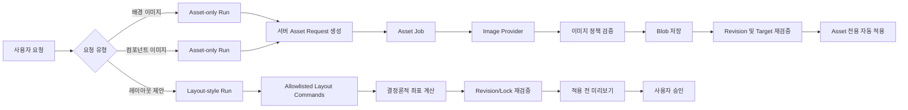

# 프로모션 빌더 AI 디자인·복합 컴포넌트 개발계획서

## 구현 상태 — 2026-07-23

- P0(Phase 1~3): 소스 반영 및 로컬 회귀 테스트 완료
- P1(Phase 4~5): 복합 컴포넌트 필드, 5단계 프로모션 빌더, 메뉴·편집기 연동을 소스에 반영
- 적용 전 필수 작업: `031_section_ai_v2_and_multi_field_components.sql` 마이그레이션 실행
- 배포 후 필수 확인: 신규 프롬프트 3종 활성 버전, asset job 재시도, 복합 컴포넌트 생성·배치·출력
- P2 다중 선택 AI 정렬은 이번 반영 범위에서 제외

## 0. 문서 정보

- 작성일: 2026-07-23
- 상태: 검토용 개발계획
- 선행 분석: `docs/기획/promo-builder-ai-design-and-component-analysis-report-2026-07-23.md`
- 적용 원칙:
  - P0 안정화가 완료되기 전에는 복합 컴포넌트와 대규모 화면 개편을 배포하지 않는다.
  - AI는 허용된 명령과 토큰만 선택하며 임의 HTML, CSS, selector, DB key를 생성하지 않는다.
  - 사용자 콘텐츠와 관리자 잠금 설정을 AI 결과보다 우선한다.
  - DB 마이그레이션과 배포는 되돌릴 수 있는 단계로 분리한다.

## 1. 목표

### 1.1 기능 목표

1. 섹션 배경 이미지 생성이 기존 레이아웃을 변경하지 않게 한다.
2. 이미지 실패 작업을 이미지 단계에서만 안전하게 재시도한다.
3. 관리자 설정에서 섹션 배경·컴포넌트 이미지·레이아웃 프롬프트를 버전 관리한다.
4. 텍스트, 이미지, CTA 필드를 N개 포함할 수 있는 복합 컴포넌트를 제공한다.
5. 프로모션 빌더를 5단계 흐름으로 정리한다.
6. 레이아웃 편집기의 3단 패널, 선택 연동, 스크롤을 안정화한다.
7. 후속 단계에서 선택한 복수 컴포넌트를 LLM이 허용된 정렬 명령으로 배치하게 한다.

### 1.2 비기능 목표

- 같은 입력과 같은 prompt version으로 실행 결과를 추적할 수 있어야 한다.
- 레이아웃 적용 시 template revision, section revision, lock policy를 서버에서 재검증해야 한다.
- 서버리스 timeout 이후에도 실행이 영구적으로 `processing`에 고착되지 않아야 한다.
- 모든 DB 상태 전이는 조건부 원자 갱신으로 처리해야 한다.
- 운영 DB 적용 전 백업 브랜치 또는 복구 지점을 확보해야 한다.

## 2. 제외 범위

이번 계획의 P0~P1에는 다음을 포함하지 않는다.

- LLM이 자유 형식 HTML/CSS를 생성해 직접 적용하는 기능
- 사용자가 등록한 프로모션 본문을 관리자 다국어 키로 관리하는 기능
- 전체 Vanilla JS 화면을 Vue로 일괄 재작성하는 작업
- AI가 사용자의 명시적 승인 없이 전체 섹션 레이아웃을 자동 확정하는 기능
- 초기화 대상으로 확정한 섹션 AI run/asset job 외의 프로모션 생성 이력 삭제

## 3. 목표 아키텍처

### 3.1 실행 경계



배경 이미지와 컴포넌트 이미지 버튼은 `assets` mode만 호출해야 한다. `assets` mode는 LLM 레이아웃 planner, `layoutPatchFromDesignPlan()`, section/item geometry 생성 경로를 완전히 우회한다. 서버는 선택된 target과 스냅샷을 검증한 뒤 이미지용 asset request만 직접 생성한다.

Asset 적용도 기존 layout apply와 분리한다. 기존 apply는 `layoutResult.layoutPatch`를 요구하므로, asset-only run에는 별도 asset apply 계약을 사용한다. 레이아웃 계획은 사용자가 별도로 `AI 레이아웃 제안`을 선택한 경우에만 기존 `layout-style` mode로 실행한다.

### 3.2 프롬프트 구성

```text
고정 시스템 정책
  + 활성 관리자 Prompt Template(version 고정)
  + 섹션/컴포넌트 이미지 정책
  + 사용자 콘텐츠 요약
  + 실행 옵션(비율, 페이드 방향, safe area, 배경색)
  = 렌더된 실행 프롬프트
```

고정 시스템 정책에는 금지 콘텐츠, 이미지 내 텍스트 금지, JSON schema, allowlist, 잠금 보호가 포함된다. 이 영역은 관리자 Prompt Manager에서 수정할 수 없다.

## 4. 데이터 모델 변경

### 4.1 Prompt Template 확장

기존 `prompt_templates`와 `prompt_template_histories` 저장소를 재사용하고 다음 `type` 값을 추가한다.

```text
section_layout_planner
section_background_image
component_image
```

기존 물리 속성을 그대로 사용한다.

- `type`
- `name`
- `body`
- `status`: draft, active, inactive, archived
- `version`
- `required_variables`
- `optional_variables`
- `provider`, `model`, `temperature`, `max_tokens`, `response_format`, `model_options`
- `change_note`, `created_at`, `updated_at`
- 한 `type`당 active row 하나를 보장하는 기존 partial unique index

신규 prompt type을 추가할 때 다음 코드도 함께 확장한다.

- `_prompt-template-store.js`의 `PROMPT_TYPES`와 기본 prompt
- `_prompt-execution-snapshot.js`의 provider/model/response format validation
- 관리자 Prompt Manager의 유형 라벨과 필터
- prompt contract 및 실행 snapshot 테스트

신규 prompt type의 provider/model/response format은 활성 prompt row를 실행 기준으로 사용한다. `SECTION_IMAGE_PROVIDER`, `SECTION_IMAGE_MODEL` 같은 환경변수는 신규 환경의 기본 prompt를 만드는 bootstrap/recovery 기본값으로만 사용하고, 이미 활성화된 관리자 설정을 실행 중 덮어쓰지 않는다.

run 생성 시점에 실행 또는 asset job에는 다음 스냅샷을 저장한다.

- `prompt_template_id`
- `prompt_template_version`
- `prompt_body_hash`
- `prompt_variables_snapshot`
- `rendered_prompt_snapshot` 또는 동일한 재현성을 제공하는 변수·body snapshot
- `provider_model_snapshot`
- `token_values_hash`

민감한 내부 시스템 정책 전체를 클라이언트 API로 반환하지 않는다.

`promo_section_design_runs`에는 최소한 다음 additive 속성을 둔다.

- `execution_key`
- `hash_contract_version`
- `prompt_snapshot jsonb`
- `token_values_hash`

과거 row는 기존 input hash를 그대로 유지하며 신규 contract version의 run과 중복 판정하지 않는다.

### 4.2 Asset Job lease

`promo_section_design_asset_jobs`에 다음 속성을 추가한다.

- `lease_token`
- `lease_expires_at`
- `heartbeat_at`
- `next_retry_at`
- `max_attempts`
- `failure_stage`
- `provider_request_id`
- `storage_key`
- `applied_at`
- `superseded_at`
- `component_instance_id`
- `target_field_key`

복합 컴포넌트 이미지의 unique 기준은 `(run_id, component_instance_id, target_field_key)`로 둔다. 기존 `(run_id, target_item_key)` 인덱스는 호환 기간에만 유지하고 신규 write가 안정화된 후 제거한다. 섹션 배경은 기존 `(run_id, target_type)` partial unique 기준을 유지한다.

`stale`은 DB status로 추가하지 않고 `status = processing AND lease_expires_at < now()`인 계산 상태로 사용한다. 기존 status check constraint는 유지한다.

Asset 상태:

```text
queued -> processing -> ready
                  └-> failed -> queued
processing --lease 만료(stale 계산)--> queued 또는 failed
queued/processing/failed -> cancelled
```

claim은 다음 조건을 원자적으로 만족해야 한다.

- status가 `queued`이거나, lease가 만료된 `processing`을 먼저 원자적으로 `queued`로 회수한 작업
- `next_retry_at`이 현재 시각 이전
- attempt가 max attempts 미만

완료·실패 갱신은 `id + lease_token + status = processing` 조건으로 처리해 만료된 worker가 최신 결과를 덮어쓰지 못하게 한다.

부모 run 집계 규칙:

- 모든 필수 asset이 ready: 부모 run `ready`
- 하나 이상 실패했지만 재시도 가능: 부모 run `generating_assets`, `canRetry = true`
- 일부 ready이고 나머지가 max attempts 도달: 부모 run `failed`, 준비된 asset 결과는 보존
- 모든 asset이 cancelled: 부모 run `cancelled`
- ready와 cancelled가 혼재: 부모 run `failed`, 자동 적용하지 않음
- 1차 구현은 부분 자동 적용을 허용하지 않고 필수 asset 전체 ready 후 target별로 적용

클라이언트 draft 적용 acknowledgement를 위해 부모 run status check constraint에 `applying`을 추가한다. 기본 전이는 `ready -> applying -> applied`이며, 적용 실패나 acknowledgement timeout은 이미지를 유지한 채 `ready`로 복구한다.

### 4.3 복합 컴포넌트

현재 단일 `field_kind` 중심 모델을 다음 물리 구조로 확장한다. 기존 테이블은 rename하지 않는다.

```text
wizard_item_components
└─ wizard_item_component_versions
   ├─ wizard_item_component_version_fields (N)
   └─ component-level style slots / capabilities

wizard_content_section_component_instances
└─ template instance overrides
```

신규 `wizard_item_component_version_fields` 권장 컬럼:

- `id`
- `component_version_id`
- `field_key`
- `name`
- `field_kind`: text, image, cta
- `text_type`
- `sort_order`
- `is_required`
- `is_locked`
- `default_value_json`
- `editor_schema_json`
- `capabilities_json`
- `image_policy_json`
- `cta_policy_json`
- `style_slots_json`
- `created_at`, `updated_at`

제약:

- `(component_version_id, field_key)` unique
- `field_key`는 `fld_<32자리 hex>` 형식으로 서버 자동 생성 후 변경 불가
- field kind별 policy schema를 DB 또는 API validation에서 강제
- component version이 publish된 후 필드 직접 수정 금지, 새 version 생성

컴포넌트 key도 서버가 자동 생성하고, 관리자는 이름만 입력한다. 예시는 `cmp_<uuid>`다.

### 4.4 섹션 key 자동 생성

- 신규 섹션 생성 시 서버가 `sec_<하이픈을 제거한 32자리 uuid>` 또는 `sec_<slug>_<suffix>`를 생성한다.
- 관리자 UI에서는 key를 읽기 전용으로 표시한다.
- 이름 변경이 key 변경으로 이어지지 않게 한다.
- API에서 사용자 지정 key를 받더라도 신규 경로에서는 무시하거나 validation error로 처리한다.

### 4.5 콘텐츠 저장 형식

저장 책임은 다음과 같이 분리한다.

| 데이터 | 저장 위치 |
|---|---|
| 관리자 필드 정의·기본값·정책 | `wizard_item_component_version_fields` |
| 템플릿별 표시명·필수·잠금·override | `wizard_content_section_component_instances.instance_config` |
| 사용자가 입력한 실제 콘텐츠 | 프로모션 draft의 `sectionInputs[sectionKey][instanceKey].fields[fieldKey]` |
| 위치·크기·이미지 프레임 스타일 | layout revision의 `itemStyles` |
| 생성 이미지 원본과 결과 | asset job 및 Blob asset reference |
| Web Output | 위 데이터를 합성한 immutable output snapshot |

`instanceKey`는 현재 `wizard_content_section_component_instances.item_key`에 대응하는 불변 키다. 신규 API에서는 의미상 instance key로 취급하되, 물리 컬럼 rename은 별도 호환 전환 없이는 수행하지 않는다.

프로모션 draft 권장 예시:

```json
{
  "componentInstanceId": "instance-id",
  "componentVersionId": "version-id",
  "fields": {
    "fld_eyebrow": { "value": "LIMITED OFFER" },
    "fld_title": { "value": "Summer Promotion" },
    "fld_artwork": {
      "assetId": "asset-id",
      "alt": "",
      "frame": {
        "widthPct": 42,
        "heightPx": 320,
        "imageFit": "contain",
        "borderRadiusToken": "radius.lg"
      }
    }
  }
}
```

이미지는 ``를 직접 삽입하지 않고 조절 가능한 이미지 프레임 요소의 `background-image`로 렌더링한다.

## 5. API 변경

### 5.1 실행 생성

기존 실행 API의 `requestMode`를 엄격하게 구분한다.

```json
{
  "requestMode": "assets",
  "assetRequest": {
    "targetType": "section-background",
    "targetFieldKey": null,
    "fadeMode": "left",
    "backgroundSize": "contain"
  }
}
```

컴포넌트 이미지:

```json
{
  "requestMode": "assets",
  "assetRequest": {
    "targetType": "item",
    "componentInstanceId": "instance-id",
    "targetFieldKey": "fld_artwork",
    "backgroundSize": "contain"
  }
}
```

레이아웃:

```json
{
  "requestMode": "layout-style",
  "selectedComponentInstanceIds": ["id-1", "id-2"],
  "allowedOperations": ["align-center", "equal-width", "distribute-vertical"]
}
```

1차 호환 단계에서는 기존 DB check constraint와 맞도록 `targetType: "item"`을 유지한다. 다만 단일 item key 대신 `componentInstanceId + targetFieldKey`를 필수 식별자로 사용한다. 복합 컴포넌트 전환이 완료되고 외부 참조가 제거된 후 `component-field`로 명칭을 변경할 수 있다.

서버는 target이 실제 섹션과 컴포넌트 버전에 존재하며 AI 이미지가 허용된 필드인지 검증한다. `assets` mode는 plan-process를 호출하지 않으며 다음 순서로 처리한다.

1. run과 target snapshot 생성
2. 서버가 고정 규칙으로 asset request 생성
3. asset job enqueue/claim
4. 이미지 생성과 Blob 저장
5. 최신 revision, lock, target field 재검증
6. asset-only apply

### 5.2 실행 중복 방지

동일 실행 재사용을 위한 hash와 unique 판정에는 다음 값을 포함한다.

- request mode
- target type
- component instance ID와 field key
- template, section, layout revision
- component version
- prompt template ID/version 또는 body hash
- token set version과 values hash
- 배경색, fade mode, aspect ratio, background size
- 사용자 콘텐츠 snapshot

신규 canonical `execution_key`를 다음 stable JSON의 SHA-256으로 생성한다.

```text
hashContractVersion
requestMode
target
template/section/layout/component revisions
prompt/token snapshots
generation options
user content snapshot
```

active status를 대상으로 `execution_key is not null` partial unique index를 추가하고 store의 신규 재사용 조회도 execution key를 사용한다. 기존 input hash index와 조회는 legacy row 호환 기간에만 유지한다. 과거 run과 신규 asset-only run이 재사용되지 않게 hash contract version을 올리고, 과거 row의 execution key는 null로 둔다.

### 5.3 실행 스냅샷

현재 누락된 다음 값을 포함한다.

- 섹션 배경색과 디자인 토큰 set/version
- component instance ID
- component version ID
- 각 field key, kind, value
- image policy의 prompt text, aspect ratio, allowed sources
- lock policy
- template/section/layout revision
- 활성 prompt template 정보

스냅샷은 생성 시 고정하며 이후 관리자 설정 변경으로 덮어쓰지 않는다.

prompt, token, component policy snapshot은 run 생성 시점에 고정한다. 처리 시점에는 현재 active 여부가 아니라 pinned version의 존재와 무결성 hash를 검증한다. 관리자가 그 사이 새 버전을 활성화해도 이미 생성된 run에는 영향을 주지 않는다.

### 5.4 이미지 재시도

권장 API 동작:

- `POST /api/promo-section-design-asset-retry`
- 입력: run ID, asset job ID
- 허용 상태: failed 또는 lease가 만료된 processing
- 성공 시:
  - 동일 asset job을 새 attempt로 재큐잉
  - 이전 레이아웃 결과와 다른 준비 완료 이미지는 유지
  - 새 lease와 attempt 기록
- 응답에 현재 상태와 `retryAfterMs` 제공

클라이언트는 HTTP 오류만으로 재시도 가능 여부를 추정하지 않고 서버의 `canRetry`를 사용한다.

### 5.5 Asset-only 적용

권장 API:

- `POST /api/promo-section-design-asset-apply`
- `POST /api/promo-section-design-asset-apply-complete`
- 입력: run ID, asset job ID, current layout revision, section inputs hash
- 검증:
  - job status ready
  - target section/component instance/field 존재
  - 현재도 AI 이미지가 허용됨
  - target field와 layout 속성 잠금 불변
  - template/section/layout/component version 일치
- 1차 호출 처리:
  - revision과 target을 검증
  - run을 `ready -> applying`으로 전환
  - asset reference와 해당 target style만 포함한 `assetMutation` 반환
  - 다른 section style, item geometry, minHeight, positionMode는 반환하지 않음
- 클라이언트 처리:
  - assetMutation을 로컬 draft에 반영하고 저장
  - 성공/실패 acknowledgement 호출
- 완료 호출 처리:
  - 성공 시 applied timestamp와 run `applied` 기록
  - 명시적 실패 또는 acknowledgement timeout 시 이미지를 다시 생성하지 않고 run을 `ready`로 복구해 적용만 재시도

서버가 run을 먼저 `applied`로 바꾸고 클라이언트가 나중에 로컬 merge하는 순서를 사용하지 않는다. `applying` 상태에는 만료 시간을 두어 브라우저 종료로 영구 고착되지 않게 한다.

### 5.6 레이아웃 적용

레이아웃 결과는 원시 좌표 전체가 아니라 변경 명령 또는 delta로 제한한다.

```json
{
  "baseRevision": 12,
  "operations": [
    {
      "type": "align-center",
      "componentInstanceIds": ["id-1", "id-2"]
    },
    {
      "type": "set-gap",
      "componentInstanceIds": ["id-1", "id-2"],
      "valueToken": "space.6"
    }
  ]
}
```

적용 API는 다음을 검증한다.

1. base revision 일치
2. 대상 인스턴스 존재
3. 잠금 속성 제외
4. 허용 operation과 token
5. 섹션 경계
6. 최소 크기 및 최대 크기
7. 금지된 겹침

검증 후 서버가 새 revision을 생성한다.

현재 apply handler에 이미 구현된 template version, token version, layout revision, component version, constraint 재검증은 유지한다. 추가 보완 범위는 section version 직접 비교, 적용 저장의 원자성, `applying` 상태와 실패 복구다.

## 6. 이미지 생성 정책

### 6.1 섹션 배경

- 섹션 wrapper: width 100%
- 섹션 배경 이미지: center 기준
- background size: `contain`
- 콘텐츠 최대 폭: 1280px
- 배경 페이드 색: 현재 섹션 배경색
- 페이드 옵션:
  - 없음
  - 왼쪽
  - 오른쪽
  - 양끝
- 페이드는 이미지 픽셀에 굽지 않고 CSS overlay로 적용

“가로 60% 이상”은 1차 구현에서 **이미지 주요 피사체의 캔버스 점유율 60~70%**로 정의한다. CSS의 실제 표시 폭은 section ratio와 `contain/cover` 설정에 따라 달라진다.

1차 범위에서는 현재 서버 validator와 기존 요구에 맞춰 섹션 배경을 `contain`으로 고정한다. 향후 섹션 배경에 `cover` 선택을 추가하려면 AI patch validator, template layout validator, 관리자 UI, renderer와 시각 회귀 테스트를 같은 배포 단위로 변경한다. 컴포넌트 이미지 프레임은 기존대로 `contain/cover` 선택을 지원한다.

### 6.2 safe area

| 대상/옵션 | 이미지 구성 |
|---|---|
| 왼쪽 페이드 | 피사체 오른쪽 약 60%, 왼쪽 안전 영역 |
| 오른쪽 페이드 | 피사체 왼쪽 약 60%, 오른쪽 안전 영역 |
| 양끝 페이드 | 피사체 중앙 약 60%, 양끝 연결 영역 |
| 페이드 없음 | 전체 캔버스 사용, 텍스트 여백 강제 안 함 |
| 컴포넌트 이미지 | 해당 필드 용도와 비율 사용, 섹션 copy safe area 미적용 |

`safeArea = none`을 중앙 copy 영역으로 처리하는 기존 fallback은 제거한다.

### 6.3 이미지 프레임

- 요소는 투명한 `div` 또는 의미가 명확한 wrapper로 구성
- 이미지 자체는 `background-image`
- 프레임의 빈 영역에 임의 배경색을 넣지 않음
- 조절 모드:
  - 정비율: corner drag 또는 Shift 정책
  - 자유 비율: side/corner drag
- 스타일:
  - contain/cover
  - 배경 위치
  - radius token
  - 원형
- 마우스와 키보드 양쪽으로 크기를 조절할 수 있어야 함
- 의미가 있는 이미지 프레임은 `role="img"`와 `aria-label`을 사용
- 장식 이미지는 `aria-hidden="true"`로 처리
- 콘텐츠의 `alt` 값은 background-image 렌더링 시 `aria-label`로 변환

## 7. 관리자 설정 UI

### 7.1 프롬프트 관리

신규 탭 또는 유형 필터:

- 섹션 레이아웃 계획
- 섹션 배경 이미지
- 컴포넌트 이미지

기능:

- draft 작성
- 변수 schema 검증
- 미리보기 렌더링
- active version 전환
- 이전 version 조회
- rollback
- 변경 이력

활성화 시 현재 실행 중인 run에는 영향을 주지 않고 신규 run부터 적용한다.

### 7.2 컴포넌트 관리

권장 화면 구조:

```text
컴포넌트 목록
└─ 컴포넌트 편집
   ├─ 기본 정보
   ├─ 필드 구성
   │  ├─ 텍스트 필드
   │  ├─ 이미지 필드
   │  └─ CTA 필드
   ├─ 스타일 슬롯
   ├─ AI 이미지 정책
   └─ 버전 및 게시
```

필드 구성 기능:

- 추가, 복제, 삭제, 정렬
- field key 자동 생성 및 읽기 전용 표시
- 이미지 비율, 허용 소스, 관리자 프롬프트 설정
- 필수·잠금·사용자 편집 허용 설정
- 게시 전 schema validation

게시된 버전은 수정하지 않고 새 draft version을 만든다.

### 7.3 템플릿 레이아웃 관리

- 섹션은 컴포넌트 버전을 선택해 인스턴스로 추가한다.
- 기존처럼 섹션 안에서 독립 item 정의를 새로 생성하지 않는다.
- 인스턴스별 기본 콘텐츠와 배치만 저장한다.
- 템플릿은 디자인 토큰 set/version을 참조한다.
- section key는 자동 생성한다.

### 7.4 감사 로그

현재 편집 화면 내부에 섞여 있는 섹션 CRUD 로그는 별도 “변경 이력” 화면으로 분리한다.

필터:

- 기간
- 관리자
- 템플릿
- 섹션
- 컴포넌트
- 작업 유형

로그는 수정 전/후 revision과 대상 ID를 기록하되 민감한 프롬프트나 사용자 콘텐츠 전문은 정책에 따라 마스킹한다.

## 8. 프로모션 빌더 UI

### 8.1 5단계

1. **테마 설정**
   - 디자인 토큰 세트
   - 배경색
   - 버튼 스타일
2. **프로모션 개요**
   - 목적, 대상, 핵심 메시지
3. **템플릿 선택**
   - 활성 템플릿 목록과 설명
4. **콘텐츠 및 레이아웃**
   - 3단 레이아웃 편집기
5. **웹 출력 확인**
   - validation 결과
   - Web Output 새 창 열기

기존 draft 단계 값은 로드 시 새 단계로 변환하고, 저장할 때 새 schema version을 기록한다.

### 8.2 3단 편집기

- 왼쪽: 섹션 목록
- 중앙: Live Preview
- 오른쪽: 섹션 속성, 컴포넌트 콘텐츠, 디자인, 위치

스크롤:

- 외곽 editor shell: `overflow: hidden`
- `section-list`: 필요할 때만 세로 스크롤
- `preview-stage`: 실제 프로모션의 세로 스크롤
- `property-form`: 필요할 때만 세로 스크롤
- iframe document 자체 scroll bar 제거

반응형:

- 충분한 폭에서는 3단 고정
- 좁은 폭에서는 좌·우 패널을 접거나 Drawer로 전환
- 중앙 preview의 최소 폭 때문에 외곽 가로 스크롤이 생기지 않게 한다.

### 8.3 선택 연동

- 좌측 섹션 클릭 → 중앙 해당 섹션으로 스크롤
- 중앙 컴포넌트 클릭 → 우측 해당 컴포넌트 아코디언 확장 및 노출
- 우측 컴포넌트 클릭 → 중앙 컴포넌트 선택 표시
- 삭제된 대상이나 숨김 대상은 안전하게 selection 해제

### 8.4 AI 상태

섹션 배경과 각 이미지 필드에 독립 상태를 표시한다.

- 생성 대기
- 콘텐츠 분석
- 이미지 생성 중
- 적용 중
- 완료
- 실패
- 재시도 가능

생성 완료 시 자동 적용하되 layout revision이 바뀌었으면 적용을 중단하고 사용자에게 재확인을 요청한다.

### 8.5 Web Output

- 대표 버튼은 preview toolbar 또는 5단계에 한 번만 노출
- 별도 페이지/새 창으로 연다.
- 팝업 차단 시 동일 탭 링크를 제공한다.
- 출력 전 누락된 필수 콘텐츠, 실패 이미지, 접근성 필수값을 검증한다.

## 9. 다중 선택 AI 정렬

### 9.1 처리 방식

1. 사용자가 컴포넌트 인스턴스를 2개 이상 선택
2. “AI 정렬 제안” 실행
3. LLM은 콘텐츠 의미와 현재 geometry를 보고 allowlisted operation을 선택
4. 결정론적 엔진이 좌표 계산
5. 충돌·경계·잠금 검증
6. before/after 미리보기
7. 사용자가 적용
8. 한 revision으로 저장하고 Undo 가능

### 9.2 허용 명령

- align-left, align-center, align-right
- align-top, align-middle, align-bottom
- distribute-horizontal, distribute-vertical
- equal-width, equal-height
- set-gap with approved token
- group-stack-horizontal, group-stack-vertical

LLM 응답에 `left`, `top`, `width`, `height`, CSS 문자열을 직접 허용하지 않는다.

### 9.3 제외 조건

- 서로 다른 섹션의 컴포넌트 동시 선택
- 잠금 인스턴스
- fixed position 컴포넌트
- 지원되지 않는 배치 mode 혼합
- 섹션 경계를 넘는 결과

## 10. 단계별 개발 계획

### Phase 0 — 기준선과 결정 확정

작업:

- 현재 DB schema, migration 적용 상태, 활성 prompt 데이터 확인
- 실제 운영/Preview 환경변수와 DB 대상 식별
- 섹션 배경은 `contain`, 기존 템플릿·섹션 구성과 섹션 AI 실행 이력은 초기화 대상으로 확정
- 보존할 디자인 토큰 세트 목록과 신규 기본 템플릿이 참조할 기본 set/version 확정
- 초기화 전 Neon 백업 브랜치, 삭제 대상/제외 대상 row count와 Blob storage key 정리 manifest 기록
- AI 배경·컴포넌트 이미지·레이아웃 생성의 현재 성공/실패 기준선 기록
- Git 상태와 배포 commit SHA 기록

완료 기준:

- 확정된 초기화 범위와 제외 데이터에 담당자 승인 기록
- DB 백업 브랜치 또는 PITR 복구 지점 확보
- 회귀 시나리오와 현재 결과 보관

### Phase 1 — P0 실행 모드 분리와 레이아웃 보호

작업:

- 배경/컴포넌트 이미지 버튼을 `assets` mode로 변경
- `assets` mode에서 planner와 `layoutPatchFromDesignPlan()`을 완전히 우회
- 서버 고정 asset request builder와 asset-only apply API 추가
- asset apply completion acknowledgement와 applying timeout 복구 추가
- `AI 레이아웃 제안`을 별도 action으로 분리
- layout patch를 delta/operation 기반으로 축소
- 기존 apply 재검증을 유지하고 section version과 적용 원자성 보완
- 실행 hash에 request mode, target, prompt/token version을 포함
- 배경 생성 시 section minHeight, positionMode, item geometry가 바뀌지 않게 보장

테스트:

- 배경 생성 전후 layout snapshot deep equality
- 컴포넌트 이미지 생성 전후 다른 컴포넌트 geometry 불변
- 같은 콘텐츠의 기존 full run이 asset-only 요청으로 재사용되지 않음
- layoutResult 없이 asset-only 자동 적용 가능
- 클라이언트 적용 실패/종료 후 이미지 재생성 없이 적용만 재시도 가능
- revision mismatch 409
- locked attribute 변경 거부

완료 기준:

- 이미지 생성만으로 레이아웃이 변경되는 경로 0건

### Phase 2 — P0 프롬프트 관리와 이미지 정책

작업:

- 기존 `prompt_templates`에 신규 type 기본값/API/UI 추가
- 신규 type provider/model/response format validator 추가
- 활성 prompt version 조회와 실행 스냅샷 연결
- `imagePolicy.promptText`, aspect ratio를 section snapshot에 포함
- section background와 component image prompt builder 분리
- fade mode, 배경색, subject coverage 반영
- `safeArea = none` 처리 수정

테스트:

- 관리자 prompt 활성화 후 신규 run에 version 반영
- 실행 도중 prompt 변경 시 기존 run snapshot 불변
- pinned prompt/token version이 inactive로 바뀌어도 snapshot 무결성이 유지되면 기존 run 처리 가능
- 컴포넌트 aspect ratio 전달
- 이미지 내 텍스트 금지 고정 정책이 관리자 body에 의해 제거되지 않음

완료 기준:

- 생성 이력에서 사용한 prompt version과 입력 policy를 추적 가능

### Phase 3 — P0 Asset Job 복구와 재시도

작업:

- lease/heartbeat/retry 컬럼 migration
- atomic claim 및 lease 만료 processing 복구
- 이미지 단계 전용 retry API
- UI의 실패·lease 만료(stale 계산)·재시도 상태 표시
- 재시도 횟수와 backoff 적용
- 부모 run의 전체 ready, 재시도 가능, max attempts 실패, cancelled 집계 구현
- storage key와 applied/superseded metadata 기록

테스트:

- 정상 성공
- provider 오류 후 failed
- 처리 중 강제 중단 후 lease 만료 복구
- 중복 worker에서 한 작업만 claim
- max attempts 이후 재시도 차단
- 일부 ready·일부 failed인 경우 부모 run 상태 검증
- ready와 cancelled 혼재 시 자동 적용 차단
- 레이아웃 결과 유지

완료 기준:

- 영구 `processing` 고착이 자동 또는 명시적 복구 가능

### Phase 4 — P1 복합 컴포넌트 전환

작업:

- component fields migration
- repository/service/API contract 수정
- 관리자 필드 편집 UI
- 템플릿 섹션의 컴포넌트 조립 UI
- Create Promo 콘텐츠 편집을 nested fields로 전환
- renderer와 Web Output 전환
- AI 이미지 target을 component field key로 변경

전환 전략은 기존 템플릿·섹션 구성을 변환하지 않고 초기화하는 것으로 확정한다.

1. 삭제 대상과 제외 대상 row count, FK 참조, Blob asset 목록 기록
2. Neon 백업 브랜치에서 복구 가능 여부 검증
3. 신규 component field schema와 flag-off dual-read backend를 additive 배포
4. 신규 schema와 롤백 경로 검증
5. 관리자와 사용자 write 경로를 maintenance 상태로 전환
6. `promo_section_design_asset_jobs`와 `promo_section_design_runs` 초기화
7. 기존 템플릿을 참조하는 `wizard_section_audit_logs`를 초기화 범위에 포함
8. 템플릿 layout/membership, component instance, 템플릿과 섹션 구성 초기화
9. 기존 item component version/component를 신규 seed 대상으로 초기화
10. 기본 복합 컴포넌트와 신규 템플릿 seed
    - 디자인 토큰 version UUID를 하드코딩하지 않고 확정된 `set_key + active version`으로 조회
    - 여러 디자인 토큰 세트는 유지하고 템플릿별 선택 가능
11. FK, row count, default/active unique 제약 검증
12. 신규 API/UI 활성화 및 maintenance 해제

초기화 SQL은 dry-run 통계와 apply를 분리하고 transaction 안에서 실행한다. Blob은 DB transaction 대상이 아니므로 먼저 삭제하지 않는다. DB 전환과 신규 화면 검증 후 manifest를 기준으로 미참조 Blob을 별도 정리한다. 프로모션 전체 디자인 생성 이력과 디자인 토큰 세트 등 초기화 범위 밖의 데이터는 삭제하지 않는다.

완료 기준:

- 텍스트 2개와 이미지 1개를 가진 컴포넌트를 생성, 배치, 편집, 출력 가능

### Phase 5 — P1 5단계·IA·편집기 개선

작업:

- 프로모션 빌더 5단계 전환
- draft schema migration
- 메뉴와 화면 명칭 변경
- Visual Editor를 레이아웃 편집기 하위 기능으로 정리
- 3단 외곽 overflow 수정
- preview click → accordion 연동
- Web Output 대표 버튼 통합
- 구형 경로 redirect와 deprecation 표시

테스트:

- 기존 draft가 올바른 새 단계에서 열림
- 좌/중/우 독립 스크롤
- 좁은 viewport에서 외곽 가로 스크롤 없음
- 프리뷰 선택과 우측 아코디언 일치
- Web Output 새 창과 팝업 차단 fallback

완료 기준:

- 사용자가 주 제작 화면과 AI 디자인 생성 화면의 역할을 구분할 수 있음

### Phase 6 — P2 다중 선택 AI 정렬

작업:

- 다중 선택 state와 접근성 조작
- allowlisted layout operation schema
- LLM planner prompt
- 결정론적 layout executor
- preview/apply/undo

테스트:

- 잠금 대상 제외
- 같은 입력과 operation의 동일 geometry
- 경계/충돌 거부
- raw CSS/좌표 응답 거부
- Undo로 정확히 이전 revision 복구

완료 기준:

- LLM이 자유 좌표를 직접 적용하지 않고 안전한 명령만 선택

### Phase 7 — 정리와 감사 로그

작업:

- 섹션 CRUD 로그 별도 화면
- Promo Wizard, Generated UI, 독립 Visual Editor 메뉴 참조 감사
- 사용하지 않는 경로·CSS·문구 key 단계적 제거
- redirect 제거 시점 기록

완료 기준:

- 구형 화면 제거 전 코드·링크·DB·문서·테스트 참조 0건

## 11. 예상 영향 파일

실제 착수 시 `rg`로 재확인한다.

### Backend

- `api/_promo-section-design-provider.js`
- `api/_promo-section-design-contract.js`
- `api/promo-section-design-runs.js`
- `api/promo-section-design-process.js`
- `api/promo-section-design-plan-process.js`
- `api/promo-section-design-asset-process.js`
- 신규 asset retry/apply/apply-complete handler
- `api/promo-section-design-apply.js`
- `api/_prompt-template-store.js`
- `api/_prompt-execution-snapshot.js`
- prompt template 관련 API
- wizard component/template 관련 API

### Frontend

- `prototype/create-promo.js`
- `prototype/create-promo.html`
- `prototype/app.js`
- `visual-editor/src/App.vue`
- `visual-editor/src/components/PromoPageRenderer.vue`
- `visual-editor/src/styles.css`
- renderer 및 Web Output 관련 파일

### DB

- 신규 migration: run prompt/token snapshot, execution key와 applying 상태
- 신규 migration: asset job lease, retry 및 applied metadata
- 신규 migration: `wizard_item_component_version_fields`
- 초기화 script: dry-run 통계와 transaction apply 분리
- 신규 seed: 복합 기본 컴포넌트와 신규 템플릿

### Tests

- contract tests
- API handler tests
- DB transition/concurrency tests
- browser smoke tests
- Visual Editor build 및 Web Output parity tests
- 실제 provider를 사용하지 않는 failure/timeout simulation
- Production 배포 후 관리자 승인 방식의 최소 canary

## 12. 테스트 전략

### 12.1 정적·단위 테스트

- prompt 변수 렌더링
- safe area와 fade option 변환
- execution key와 hash contract version
- layout operation schema
- component field schema
- old draft → new step mapping

### 12.2 API 테스트

- 인증과 관리자 권한
- target field 유효성
- prompt active version 선택
- asset retry 상태 전이
- asset-only planner 우회
- asset-only apply와 acknowledgement
- applying acknowledgement timeout 복구
- revision mismatch
- lock violation

핸들러를 직접 호출하거나 로컬 HTTP 환경에서 실제 요청·응답을 검증해야 하며, 문자열 패턴 검사만으로 완료하지 않는다.

### 12.3 DB 테스트

- partial unique index
- FK와 cascade/restrict 정책
- atomic claim 경쟁
- 만료 lease 회수
- 부모 run 집계
- component version publish 불변성
- migration 전후 row count

### 12.4 브라우저 테스트

필수 흐름:

1. 관리자에서 prompt draft 작성 및 활성화
2. 복합 컴포넌트 생성 및 publish
3. 템플릿 섹션에 컴포넌트 배치
4. 프로모션 빌더에서 각 필드 콘텐츠 입력
5. 배경 이미지 생성 시 planner가 호출되지 않고 기존 레이아웃이 불변인지 확인
6. 컴포넌트 이미지 생성 후 자동 적용
7. 실패 후 이미지 단계 재시도
8. 프리뷰 컴포넌트 클릭 후 우측 아코디언 열림
9. Web Output 새 창과 Preview 동등성 확인

viewport:

- 1440px
- 1280px
- 1024px
- breakpoint 경계값

### 12.5 시각 회귀

- 섹션 배경색과 페이드 색 연결
- fade left/right/both/none
- 섹션 배경 contain, 컴포넌트 이미지 프레임 contain/cover
- 이미지 프레임 투명 배경
- 정비율/자유 비율 resize
- 3단 패널 독립 스크롤
- AI 진행·실패·재시도 표시

## 13. 배포 전략

### 13.1 원칙

- migration과 code가 서로 다른 순서로 배포되어도 짧은 기간 호환되도록 expand → migrate/seed → switch → contract 순서를 사용한다.
- Production DB migration 전에 Neon 백업 브랜치 또는 PITR 지점을 만든다.
- 배포 commit SHA와 migration 적용 결과를 기록한다.

### 13.2 권장 순서

1. additive DB migration
2. 구·신 schema를 읽을 수 있는 backend
3. seed/data conversion
4. frontend feature flag 활성화
5. smoke test와 관찰
6. 구형 write 경로 차단
7. 안정화 기간 후 구형 컬럼·화면 제거

### 13.3 Feature Flag 및 Capability

현재 공통 feature flag 저장소가 없으므로 초기에는 큰 전환 단위 두 개만 사용한다.

- `SECTION_AI_V2`
- `MULTI_FIELD_COMPONENTS`

세부 Phase 상태는 서버 capability API가 DB migration과 필수 prompt 활성 상태를 확인해 반환한다. 프런트는 환경변수를 직접 읽지 않고 capability 응답을 사용한다. DB schema나 active prompt가 없는 환경에서 UI만 활성화되지 않게 한다.

## 14. 롤백

### P0 롤백

- 신규 request mode flag 비활성화
- asset-only 경로에 문제가 있으면 이미지 생성 버튼을 일시 비활성화
- 레이아웃 붕괴 위험이 있는 기존 full 자동 경로로 복귀하지 않음
- additive 컬럼은 유지 가능

### 복합 컴포넌트 롤백

- 신규 데이터는 export 후 보존
- 구형 데이터를 초기화하므로 Neon 백업 브랜치/PITR가 전체 복구 수단이며 백업 검증이 필수
- 초기화와 신규 seed가 완료된 이후에는 feature flag만으로 구형 데이터를 복구할 수 없음

### 화면 개편 롤백

- 기존 route alias 유지
- draft schema version으로 이전 단계 mapping 복구
- 문구 key와 메뉴 변경을 동일 release 단위로 되돌림

## 15. 모니터링

필수 지표:

- 실행 모드별 성공률
- asset job 평균/최대 처리 시간
- `processing`, `stale`, `failed` 건수
- attempt 분포와 max attempt 도달 건수
- provider별 오류 코드
- prompt version별 실패율
- layout revision conflict 비율
- 이미지 자동 적용 실패율

로그 식별자:

- run ID
- asset job ID
- template/section/component instance ID
- prompt template ID/version
- provider request ID
- deployment commit SHA

프롬프트와 사용자 콘텐츠 전문은 기본 로그에 출력하지 않는다.

### 15.1 Blob 자산 수명주기

- asset job에 Blob `storage_key`와 적용 상태를 저장한다.
- 재생성으로 대체된 이미지에는 `superseded_at`을 기록한다.
- 현재 적용 중인 asset은 정리 대상에서 제외한다.
- 취소·실패·미적용 run의 orphan Blob은 보존 기간 후 정리한다.
- 정리 작업은 dry-run 목록, 삭제 수, 실패 수와 실행자를 감사 로그에 남긴다.
- private Blob 삭제 전 DB reference가 0인지 다시 확인한다.

## 16. 보안·권한

- prompt template 작성·활성화와 component publish는 관리자 권한으로 제한
- public API는 활성화된 템플릿과 사용자에게 필요한 policy만 반환
- server-side allowlist로 prompt injection 결과를 차단
- Blob private asset은 인증된 proxy 또는 허용된 signed URL로 전달
- provider API key와 DB URL은 클라이언트 번들에 포함하지 않음
- 감사 로그에서 credential, 전체 프롬프트, 민감 콘텐츠 마스킹

## 17. 위험과 대응

| 위험 | 영향 | 대응 |
|---|---|---|
| 이미지 버튼이 여전히 full run 호출 | 레이아웃 붕괴 | UI와 API 양쪽에서 target mode 강제 |
| assets mode가 planner를 호출 | 레이아웃 붕괴 지속 | 전용 asset request builder와 planner 호출 금지 테스트 |
| 과거 full run 재사용 | 잘못된 결과 적용 | request mode·target·prompt version을 execution key에 포함 |
| prompt 활성 버전 변경 중 실행 | 재현 불가 | 실행 생성 시 version/hash snapshot |
| serverless 중단 | processing 고착 | lease, heartbeat, stale recovery |
| 일부 asset만 성공 | 부모 run 고착 또는 부분 적용 | 부모 집계 규칙과 전체 ready 적용 정책 |
| 복합 컴포넌트 전환 중 FK 오류 | 배포 실패 | additive migration, 사전 orphan 검사, transaction |
| 기존 draft 단계 불일치 | 사용자 진행 상태 손실 | schema version과 mapping |
| contain과 width 100% 요구 충돌 | 기대와 다른 이미지 | 섹션 배경 contain 고정 안내와 subject coverage 별도 정의 |
| LLM 자유 좌표 적용 | 레이아웃 불안정 | allowlisted command + deterministic executor |
| 구형 화면 즉시 삭제 | 링크·테스트 회귀 | redirect와 참조 감사 후 제거 |

## 18. 완료 정의

전체 계획 완료 조건:

- 배경·컴포넌트 이미지 생성이 다른 레이아웃 속성을 변경하지 않는다.
- asset-only 실행에서 레이아웃 planner가 호출되지 않는다.
- 실패 또는 lease가 만료된 이미지 작업을 레이아웃 재생성 없이 재시도할 수 있다.
- request mode, target, prompt/token version이 다른 실행은 서로 재사용되지 않는다.
- 관리자 prompt version과 컴포넌트 image policy가 실제 생성에 반영되고 추적된다.
- 텍스트 2개, 이미지 1개 이상을 가진 복합 컴포넌트를 생성·배치·편집·출력할 수 있다.
- 프로모션 빌더 5단계와 명칭이 일관되고 기존 draft가 정상 복원된다.
- 3단 패널이 독립적으로 스크롤되고 외곽 가로 스크롤이 없다.
- 프리뷰에서 선택한 컴포넌트의 우측 아코디언이 열린다.
- background-image 프레임이 의미에 따라 `role="img"`/`aria-label` 또는 `aria-hidden`을 제공한다.
- Web Output이 별도 페이지에서 Preview와 동일하게 출력된다.
- 자동화 테스트, 운영 smoke test, 모니터링 확인을 모두 통과한다.

## 19. 착수 권고

첫 개발 단위는 Phase 1~3으로 제한한다. 즉, 복합 컴포넌트나 메뉴 개편보다 먼저 다음 묶음을 완료한다.

1. Asset-only 실행 분리
2. Asset-only apply와 실행 중복 방지 계약
3. 레이아웃 revision·잠금 보호
4. 관리자 prompt 연결
5. stuck job 복구와 이미지 재시도

이 묶음이 안정화되어야 이후 데이터 모델과 UI 개편에서 발생한 오류를 AI 실행 오류와 구분할 수 있다.
