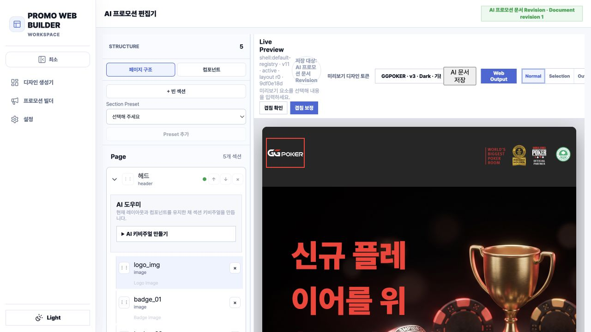
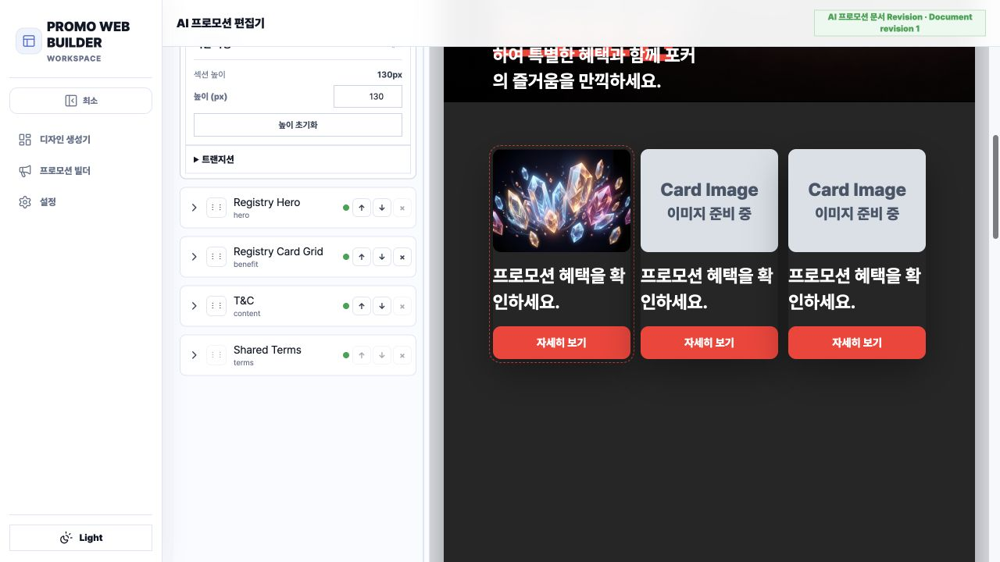
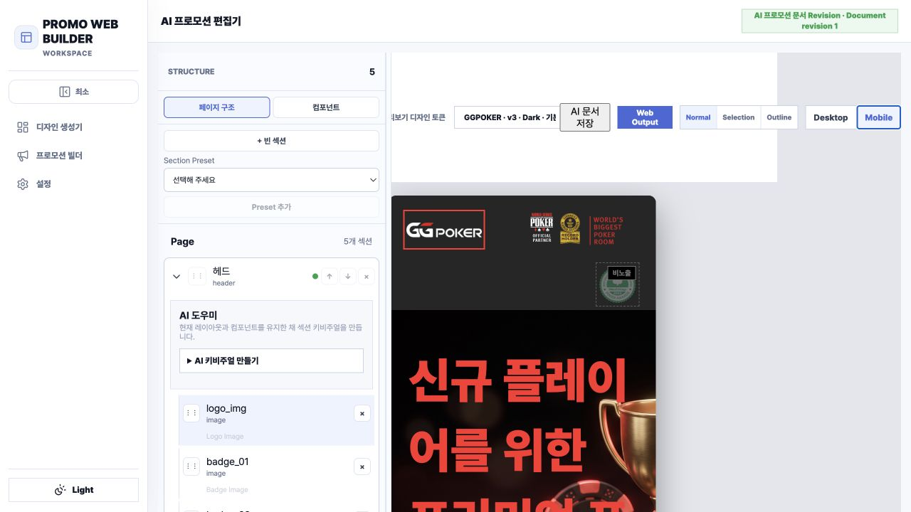

# AI Mode Live Preview UI 품질 검토

검토일: 2026-08-20  
대상: 운영 환경의 AI 프로모션 생성 결과 (`AI 프로모션 문서 Revision 1`)  
입력 요약: 신규 플레이어 대상 프리미엄 포커 프로모션, 명확한 혜택·역동성·신뢰감 요구

## 결론

현재 결과는 단순히 디자인 취향이 낮은 수준이 아니라, **레이아웃 완성 조건을 충족하지 못한 초안이 Live Preview에서 완성 결과처럼 노출되는 상태**다. 데스크톱에서 Hero 충돌, 반복·과도한 빈 공간, 미완성 이미지가 확인되며 모바일에서는 제목과 비주얼이 잘린다. 내장 `겹침 확인`도 1개 컴포넌트 겹침을 감지했지만, 이미지 미완성·과도한 공백·반복 콘텐츠·모바일 잘림 같은 품질 실패는 차단하지 못했다.

## 캡처

### 데스크톱 상단

### 카드 영역

### 모바일

전체 페이지 캡처: [01-ai-live-preview-desktop.png](./01-ai-live-preview-desktop.png)

## 구간별 상태

1. **AI 구성 → Hero — Critical**
   - 제목 크기와 폭이 콘텐츠 길이에 맞지 않아 비정상적으로 줄바꿈된다.
   - 제목·본문·CTA·키비주얼 사이의 안전 영역이 보장되지 않는다.
   - 모바일에서 제목과 트로피 이미지가 크게 잘린다.

2. **혜택 카드 → 이미지/콘텐츠 — Critical**
   - 3개 카드 중 2개가 `이미지 준비 중` 상태다.
   - 모든 카드의 설명과 CTA가 동일해 혜택 간 의미 구분이 없다.
   - 필수 자산이 준비되지 않았는데도 결과가 완성된 Preview처럼 표시된다.

3. **전체 페이지 → 흐름/리듬 — Critical**
   - 카드 이후 큰 빈 공간이 이어지고, 아래쪽에 카드 형태가 다시 나타난다.
   - T&C와 Shared Terms가 분리되지만 시각적 위계가 약하고 페이지를 과도하게 길게 만든다.
   - 섹션 간 배경·밀도·콘텐츠 역할 변화가 거의 없어 하나의 캠페인 스토리로 읽히지 않는다.

4. **모바일 재배치 — Critical**
   - 데스크톱 구성을 축소한 수준으로 보이며 모바일용 타이포그래피와 이미지 크롭 규칙이 부족하다.
   - 상단 배지, 큰 제목, 우측 비주얼이 좁은 폭에서 서로 경쟁한다.
   - 한 화면에서 핵심 메시지와 CTA를 안정적으로 읽기 어렵다.

## 원인 진단

### 1. 현재 Composer 계약이 품질 판단을 의도적으로 제거한다

현재 프롬프트는 Composer가 `visual quality judgements`를 하지 않도록 제한하고, 레이아웃은 기본값 또는 사전식 정렬상 첫 값을 선택하도록 강제한다. 이 규칙은 출력 안정성에는 유리하지만 콘텐츠 길이, 이미지 비율, 화면 폭에 맞는 레이아웃 선택을 막는다.

- `Runtime-Compatible Prompt v3` 10–11행: 시각 품질 판단 금지
- 65–67행: 기본 레이아웃 우선, 아니면 사전식 최소값
- 83행: 경고와 요약을 항상 비움

### 2. 이미 존재하는 레이아웃 메타데이터가 선택에 충분히 사용되지 않는다

레지스트리 후보에는 `widthProfile`, `alignment`, `contentRegion`, `visualBalance`, `density`, `purposeTags`를 담을 수 있고 migration 059도 이를 콘텐츠 길이와 시각 의도에 맞추라고 정의한다. 그러나 실제 생성 규칙은 여전히 default-first라 메타데이터 기반 선택이 무력화될 수 있다.

### 3. Preview 전 품질 게이트가 없다

현재 필요한 것은 LLM의 자유도를 무작정 키우는 것이 아니라 다음 세 가지 검증을 분리해 강제하는 것이다.

1. **Content–Layout Fit Gate**: 제목 길이, 본문 길이, 이미지 비율, CTA 수를 레이아웃 메타데이터와 대조한다.
2. **Asset Readiness Gate**: 필수 이미지가 생성·해결되지 않았으면 Preview를 `초안/생성 중`으로 유지한다.
3. **Render QA Gate**: 데스크톱과 모바일에서 overflow, collision, clipping, 비정상 section height, 과도한 dead space, 중복 콘텐츠를 검사한다.

내장 겹침 검사가 1건을 잡았다는 점은 기초 검사가 존재함을 보여주지만, 현재 범위는 출시 품질 판단에 부족하다.

### 4. Planner snapshot 계약도 점검이 필요하다

`plannerRegistryCandidateSnapshot()`은 섹션의 레이아웃 메타데이터는 전달하지만, 프롬프트가 보존하라고 요구하는 `sortOrder`가 해당 매핑에 보이지 않는다. 서버 정규화가 최종 순서를 보장하더라도 Planner와 런타임 계약의 불일치는 반복·공백·순서 문제를 추적하기 어렵게 만든다.

## 개선 우선순위

### P0 — 실패 결과 차단

- 겹침, 잘림, overflow, 미완성 필수 이미지가 있으면 `완료` 상태와 Web Output을 차단한다.
- Desktop 1440px와 Mobile 390px 렌더 검사를 AI 생성 파이프라인의 필수 단계로 둔다.
- Hero 제목은 컨테이너 기준 줄 수·최소 글자 크기·CTA 안전 영역을 통과해야 한다.
- 비정상적인 섹션 높이와 연속 빈 공간을 수치로 감지한다.

### P1 — 레이아웃 선택 품질

- default-first 규칙을 `metadata score → default tie-breaker`로 변경한다.
- 점수 입력: copy length, component count, asset aspect ratio, widthProfile, density, alignment, visualBalance.
- 모바일용 preset 또는 breakpoint override가 없는 레이아웃은 AI 후보에서 제외한다.

### P1 — 콘텐츠 역할과 다양성

- 카드마다 제목·핵심 수치/혜택·설명·CTA 목적을 다르게 생성하고 중복 문구를 검출한다.
- Hero, benefit, proof/trust, participation, terms의 역할을 분리한다.
- 입력 언어를 페이지 UI와 약관 요약까지 일관되게 유지하되, 법정 원문이 필수인 경우 언어 구분을 명시한다.

### P2 — 시각 시스템

- 섹션별 배경 톤, 최대 폭, vertical rhythm, 카드 elevation, 이미지 처리 규칙을 토큰화한다.
- Hero와 카드가 동일한 빨강 CTA만 반복하지 않도록 primary/secondary action 체계를 둔다.
- Terms는 본문 흐름을 방해하지 않도록 접힘/요약/전문 링크 패턴을 검토한다.

## 접근성 위험과 검토 한계

- 모바일 제목 잘림과 비정상 줄바꿈은 확대·좁은 화면 사용자의 읽기를 직접 방해한다.
- 작은 약관 텍스트와 어두운 플레이스홀더는 대비와 가독성 위험이 있다.
- 절대 위치 기반 배치라면 시각 순서와 DOM 읽기 순서가 어긋날 수 있다.
- 이번 검토는 화면 캡처와 현재 DOM을 기준으로 했으며 키보드 탐색, 스크린리더, 실제 색 대비 수치, 다중 브라우저는 별도 테스트가 필요하다.

## 권장 목표 상태

AI 모드는 한 번에 완벽한 디자인을 발명하는 기능이 아니라, **승인된 디자인 시스템 안에서 품질 검사를 통과한 조합만 결과로 승격하는 기능**이어야 한다. 현재는 조합 생성은 되지만 승격 기준이 부족하다. 우선 P0 게이트를 추가한 뒤 메타데이터 기반 선택과 콘텐츠 다양성을 개선하는 순서가 가장 효과적이다.
