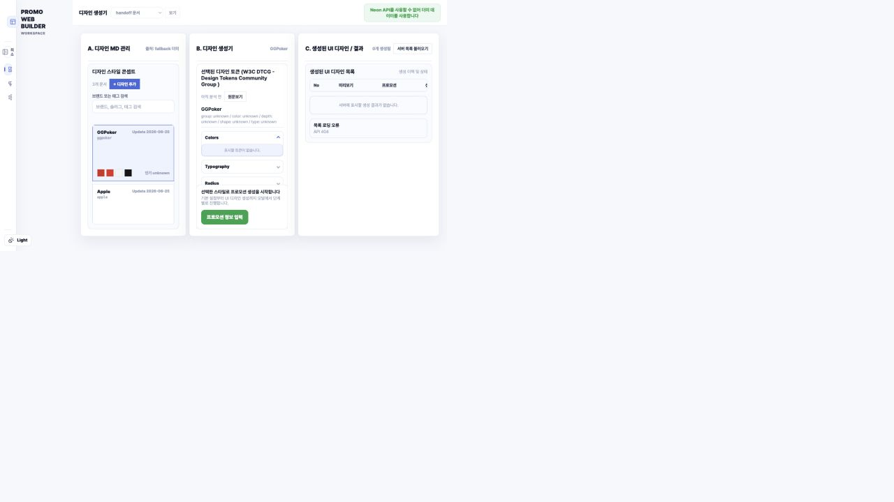
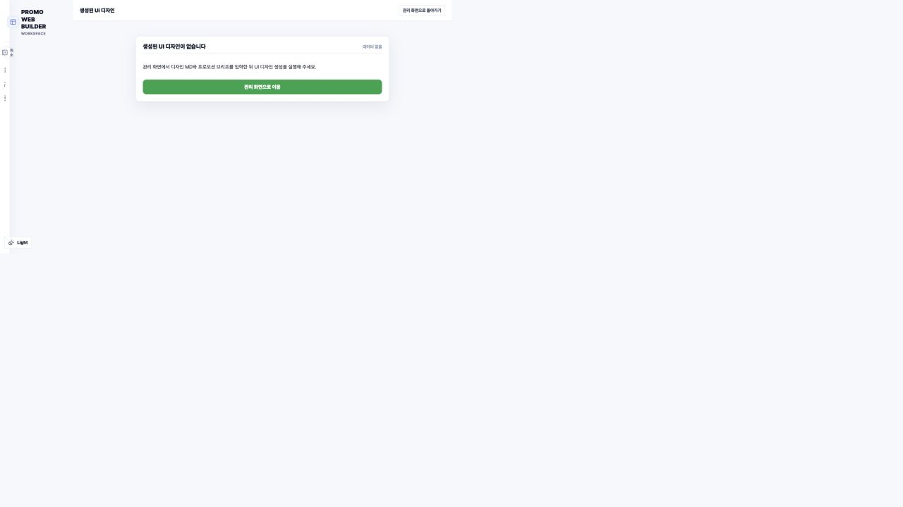

# 프로모션 레이아웃·UI 디자인 품질 검토

## 검토 범위

- 현재 디자인 생성기 화면
- 생성 결과 화면의 현재 상태
- `promo_page_composer` 수정 프롬프트
- Contract v3 후보 snapshot, Layout Preset metadata 및 renderer 구조

## 전체 판단

현재 구조는 스키마 안전성과 재현성은 높이지만, 시각적 품질을 높이는 선택 로직을 사실상 제거한
상태다. renderer는 자유 배치, desktop/mobile preset, 디자인 토큰을 지원하므로 표현력 자체가
가장 큰 병목은 아니다. 핵심 병목은 composer가 승인된 후보 중 무엇이 현재 콘텐츠와 시각 의도에
더 적합한지를 평가하지 않는다는 점과, 후보 snapshot에 필요한 품질 신호가 충분히 전달되지
않는다는 점이다.

## 단계별 상태

### 1. 디자인 생성기 — 주의 필요

- fallback 상태에서 토큰 데이터가 비어 있어 브랜드 스타일의 근거가 보이지 않는다.
- 넓은 화면에서 핵심 작업 영역이 좌측 일부에만 몰리고 우측에 큰 공백이 남는다.
- 카드 내부의 작은 글자와 촘촘한 정보 밀도로 인해 시각적 위계가 약하다.
- 실제 운영 데이터가 연결되면 일부 문제는 달라질 수 있으나, 현재 화면만 보면 premium web
  design 품질을 전달하지 못한다.

### 2. 생성 결과 — 검증 차단

- 현재 실행 환경에는 생성 완료된 프로모션 페이지가 없어 결과 페이지의 실제 시각 품질,
  반응형 동작, 대비, overflow, motion은 확인할 수 없었다.
- 따라서 아래 원인 분석은 새로 캡처한 화면과 현재 prompt/code contract에 근거한다.

## 핵심 원인

1. 수정 프롬프트가 모델에게 visual quality judgement를 금지한다.
2. template은 가장 작은 id, layout은 default 또는 사전순 첫 값을 선택한다.
3. optional section을 제외하고 motion도 항상 끄므로 페이지의 서사와 리듬이 약해진다.
4. `selectionMetadata`의 widthProfile, visualBalance, density, purposeTags, selectionWeight를
   전달하면서도 프롬프트가 이를 사용하지 않는다.
5. v3 planner snapshot은 `sortOrder`, `fixedPosition`, `rankScore`를 누락한다. 특히
   prompt와 output schema가 `sortOrder`를 요구하므로 모델은 입력에 없는 값을 만들 가능성이 있다.
6. 콘텐츠 binding을 fieldKey 완전 일치로만 제한해, 의미가 같지만 이름이 다른 구성요소가 빈
   콘텐츠로 남을 수 있다.
7. 최종 screenshot 기반 visual QA와 대체 preset 재시도 단계가 없다.

## 권장 개선 순서

### P0 — composer 선택 정책 복구

- raw 좌표 생성은 계속 금지한다.
- 대신 승인된 Layout Preset의 `selectionMetadata`를 사용해 copy length, content purpose,
  density, width profile, visual balance에 가장 맞는 `layoutKey`를 선택한다.
- 동일 점수에서만 안정적인 key 정렬을 tie-breaker로 사용한다.

### P0 — 서버 품질 게이트 추가

- desktop/mobile geometry completeness
- text overflow와 component collision
- 최소 CTA 높이와 touch target
- 색상 대비 위험
- hero hierarchy와 content capacity
- 필수 asset 누락

검사를 통과하지 못하면 다음 점수의 preset으로 자동 재시도한다.

### P1 — snapshot 품질 신호 보강

`sortOrder`, `fixedPosition`, `rankScore`, `matchedCapabilities`, 실제 copy-length bucket,
asset availability를 planner snapshot에 포함한다.

### P1 — 역할을 3단계로 분리

1. Page composer: section 구성과 이야기 순서
2. Layout selector: metadata 기반 preset 선택
3. Visual QA: 렌더 screenshot을 검사하고 preset 교체 또는 보정 요청

### P2 — 후보 라이브러리 강화

hero, benefit, progression, social proof, FAQ, legal 등 각 역할에 대해 desktop/mobile이 함께
완성된 고품질 preset을 여러 개 준비한다. 좋은 후보가 없으면 프롬프트만 개선해도 결과는 좋아지지
않는다.

## 접근성 위험

- 현재 화면의 작은 보조 텍스트와 옅은 회색 정보는 대비와 가독성 위험이 있다.
- 실제 생성 페이지가 없어 키보드 순서, focus 표시, mobile reflow, zoom, screen reader 구조는
  확인하지 못했다.
